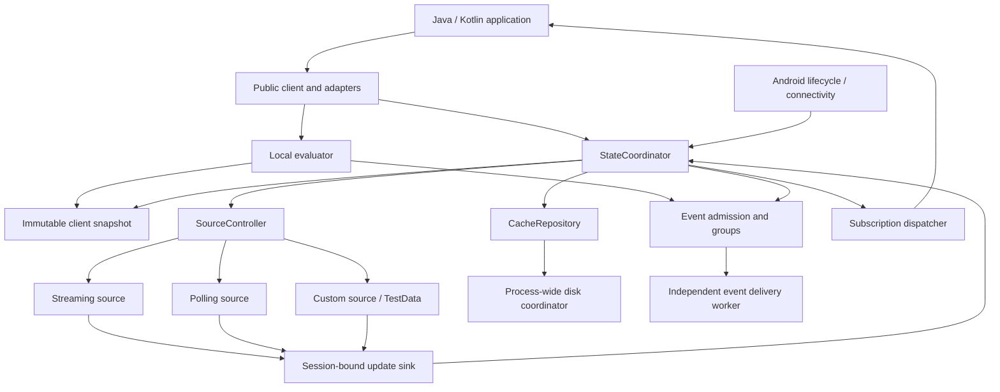

# FeatBit Android Client SDK Architecture

Date: 2026-10-02. Status: Phases 1–5 implemented; Phases 6–7 remain planned. See [Phase 5 implementation](./docs/phase-5.md) and [verification](./docs/verification.md) for actual tested boundaries.

This document turns the accepted scope in [the development plan](./plan.md) into component boundaries, state ownership, concurrency rules, and implementation checkpoints. Names and additional design choices below are proposals. They do not silently resolve pending product decisions or establish tested behavior.

## 1. Basis and scope

The SDK is implemented in Kotlin **1.9.25**, with public APIs compatible with Java callers. Kotlin applications additionally receive suspend and Flow conveniences over the same implementation. Java references in this document describe consumer compatibility and independent consumer tests. One client owns one current user context. FeatBit evaluates targeting on the server; the SDK stores and converts evaluated results locally.

The source baseline reviewed for this design is:

Local planning documents evolve together and use relative links rather than manually synchronized content hashes. At a formal design freeze, include them in a Git commit or tag so the reviewed versions can be recovered. The source commits below and pinned upstream evidence remain fixed reference baselines; this document does not create a commit or tag.

| Source | Baseline |
| --- | --- |
| Android repository | Phase 1 started from `c0730f3f70d62a76a1a37bcb556783b58d3c6a6e`; Phase 2 started from `ab973d1` and remains in the working tree |
| Development scope | [Development plan](./plan.md); evolving working document |
| Comparison/scope decisions | [Feature comparison and scope decisions](./launchdarkly-feature-comparison.md); evolving working document |
| Shared specifications | `sdk-spec` HEAD `3f08faa77dbf70bea208bd8ab946c2aa0b38ffad`; Phase 2 observed existing English changes in conformance/identity/public-api; local untracked Chinese supplements are excluded |

Read together: [core specification](../sdk-spec/client-side/README.md), [protocol](../sdk-spec/client-side/reference/protocol.md), [mobile supplement](../sdk-spec/client-side/mobile/README.md), [Android requirements](../sdk-spec/client-side/mobile/android.md), and [feature decisions](./launchdarkly-feature-comparison.md). The plan adds Android-specific capabilities such as runtime online transitions and recovery after post-connection Streaming failures. When a genuine conflict is found, record it and resolve the behavioral contract before implementing that path.

The OpenFeature Provider remains a separate repository and product consuming the published SDK. This library has no OpenFeature dependency. Persistent events, multiprocess sharing, a multi-environment manager, general plugins, and public replacement of storage/platform/event processing remain outside the first release.

## 2. Packaging and dependencies

Publish one core AAR. Internal packages express responsibilities without separate Gradle modules for each subsystem.

Use Maven groupId `co.featbit` and artifactId `featbit-client-android`, giving the core SDK coordinates `co.featbit:featbit-client-android:<version>`. The project owner confirmed namespace ownership and accepted the artifact naming on 2026-09-30. The SDK package root remains `co.featbit.android`. The separate OpenFeature Provider uses `co.featbit:featbit-openfeature-provider-android:<version>` in its own repository. Release versions and publishing account credentials remain release setup items.

```text
featbit-android-client-sdk/
  sdk/                         Android library; only published module
    src/main/kotlin/co/featbit/android/
      api/                     Client, options, users, values, results, listeners
      kotlin/                  Suspend and Flow adapters
      datasource/              Public factory, lifecycle, update sink and models
      testing/                 Public TestData utility
      internal/
        runtime/               StateCoordinator, policy, waits, effect scheduling
        identity/              Validation, effective context, anonymous identity
        evaluation/            Conversion preparation and local reads
        store/                 Immutable snapshots, full/patch reducer, provenance
        sync/                  Source controller, Streaming/Polling, recovery
        protocol/              Token, endpoints, wire DTOs, codecs, validation
        networking/            RequestPolicy, request builders, transport adapters
        persistence/           Cache repository and process-wide disk coordinator
        events/                Admission, groups, delivery, flush accounting
        android/               Application visibility, connectivity, dispatch
        diagnostics/           Safe errors, logging and loss counters
    src/test/kotlin/co/featbit/android/         Local unit tests
    src/androidTest/kotlin/co/featbit/android/  Device/emulator tests
  consumer-tests/java/         Minimal Java AAR/API/R8 verification fixture
  consumer-tests/kotlin/       Minimal Kotlin AAR/API/R8 verification fixture
  integration/                 Versioned fixtures and server-test entry points
```

The Phase 1 subset of these paths now exists; later runtime components remain planned. Samples/demo Apps are deferred; independent consumer fixtures are in `consumer-tests/`. SDK implementation and test sources use explicit `kotlin/` source directories; Java consumer compatibility does not require SDK sources in a `java/` directory. Phase 1 validates these source sets and uses explicit public declarations and an AAR API baseline. Kotlin `internal` alone is not a complete Java binary API boundary. Consumers must not need internal packages.

Retain the plan's candidate Coroutines, OkHttp, Serialization and AndroidX dependencies for Phase 1 validation. Do not expose OkHttp, Serialization DTOs, Android lifecycle owners, or OpenFeature types in the foundational API. Flow/suspend adapters intentionally expose coroutine integration in their own namespace. The supporting toolchain and dependency versions remain candidates until consumer builds pass.



Dependencies point inward toward immutable domain models and internal ports. Transports produce updates; they cannot mutate the store. Persistence returns load results; it cannot mark readiness. Event failures cannot control synchronization. Only the coordinator can grant a source authority or publish a new client snapshot.

## 3. State ownership and invariants

`StateCoordinator` owns transitions, using a short `StateGate` critical section plus bounded effect workers. This is a single logical state owner, not a dedicated thread required for every read. Synchronous API acceptance and worker results enter the same reducer under the gate. No networking, disk access, JSON parsing, application callback, logger, or custom-source code runs under that gate.

| State/model | Owner and meaning |
| --- | --- |
| `EffectiveContext` | Immutable key, name and complete attributes after automatic enrichment; used by synchronization/cache matching |
| `ClientSnapshot` | Atomically published context, result view, readiness, offline intent, closure state and analytics admission state |
| `ResultSnapshot` | Remote or Custom-local records with explicit provenance, surviving bootstrap records, bootstrap-shadow history and paired remote cursor where applicable; optional derived conversion data |
| `SyncState` | Configured/effective modes, active authority, confirmation, pause reasons, terminal state, timestamps and recovery state |
| `EventState` | Independent collection/delivery permissions, bounded groups, attempts, terminal outcome and counters |
| `WaitRegistry` | Operation IDs, context binding, deadlines and once-only outcomes |
| `CacheNamespaceState` | Process-wide cache ordering, namespace erasure epoch, entry revisions and active leases |

Never collapse these dimensions into one `isReady` boolean. A client can have usable cache while waiting for remote confirmation; previously confirmed values while paused; or healthy synchronization while analytics is terminal.

The following tokens have separate jobs:

| Token | Changes when | Protects against |
| --- | --- | --- |
| `contextGeneration` | Every accepted Identify, including same-key and A → B → A transitions | Earlier context work appearing current |
| `identityOperationId` | Valid identity-operation reservation, including anonymous preparation, or closure | Slow anonymous preparation replacing a later accepted identity operation |
| `sourceSessionId` | Source replacement, reconnect, pause, offline, takeover or close | Old transport callbacks within the same context |
| `commitSequence` | Every accepted authoritative data commit, including equal-timestamp updates and confirmations | Recovery candidates or prepared updates overwriting an intervening commit |
| `localLoadId` | New cache initialization attempt or invalidation | Cache arriving after bootstrap/remote initialization or clear |
| `deliveryEpoch` / `attemptId` | Delivery permission invalidation / each HTTP attempt | Late event responses acknowledging or terminating newer work |
| `modeRevision` | Accepted online/offline intent change or invalidation of a pending opposing transition | Delayed validation, cleanup or start effects reversing a newer mode transition |
| `cacheEpoch` / `writeSequence` | Namespace clear / process-local logical cache commit before asynchronous persistence | Old reads/writes undoing erasure or overwriting a later durable commit in the same process |

Tokens are local implementation details. Never send them as invented protocol fields. User-key equality, cancellation, and remote timestamps are insufficient substitutes for authority checks.

Key invariants:

1. At most one source may commit authoritative flag data. A recovery candidate has staging authority only.
2. Each evaluation uses one coherent context/result/eligibility snapshot.
3. A full/patch batch and its cursor become visible atomically.
4. Old source callbacks cannot change values, readiness, errors, wait outcomes or recovery scheduling.
5. Terminal synchronization and terminal event delivery are independent and cannot be reset on that instance.
6. Pending work counts, waiters and callback queues are bounded; Flag update payload bytes and record counts have no SDK-imposed caps. Close and invalidation cannot be starved by a full data queue.
7. After close, retained values and final status remain readable; nothing can restart the client.

## 4. Public API boundary

Implement the public API in Kotlin, using builders, immutable input copies, explicit nullability, ordinary result objects, and callback interfaces compatible with Java callers. Suspend adapters await the same operation handle; they do not reimplement behavior. No public API requires catching a recoverable SDK exception.

| Surface | Proposed contract |
| --- | --- |
| Creation | Asynchronous `CreationResult<FeatBitClient>`; validate synchronously capturable input before workers start, resolve anonymous identity off the UI thread, then publish a client without waiting for the server |
| Initialization | Bounded `awaitReady` bound to the context current at acceptance; Identify supersedes an older context wait |
| Identity | `identify`, `identifyAnonymous`, `resetAnonymousIdentity`; local transition acceptance separated from eventual synchronization outcome |
| Evaluation | Boolean, Number, String, generic immutable value, JSON text/parsed helpers and detailed forms; `allVariations` returns raw-string details |
| Status | `getConnectionInformation`, `isOffline`, `getVersion`; local immutable reads, including after close |
| Runtime mode | `setOffline`, `setOnline`; completion means intent/transition applied, not synchronization readiness |
| Events | `track(name, numericValue = 1.0)`, prompt `flush`, bounded waiting flush |
| Subscriptions | Global changed keys, one flag, synchronization status; independent closeable handles and Flow adapters |
| Persistence | Asynchronous flag-cache clearing with explicit namespace/context scope; anonymous identity reset is separate |
| Shutdown | Idempotent nonblocking close request with a bounded completion result; concurrent callers share cleanup |

Operation-specific results distinguish success, invalid input/configuration, superseded, timeout, closed, terminal failure, deferred/offline and cleanup failure where applicable. Flush additionally distinguishes all-delivered, processed-with-loss, empty and disabled. Avoid one success boolean that conflates them. Registration can return a result containing a subscription handle, including a closed-client outcome.

Proposed `FbValue` kinds: Boolean, finite Double Number, String, immutable Array/Object, and explicit JSON Null. Use the same finite numeric range for parsed JSON numbers; out-of-range values return WrongType, and document IEEE-754 rounding. No generic `Any`/`Object`, integer-specific API, or host-language null as a successful JSON-null value. Generic conversion follows declared flag type; typed helpers convert the selected string even when its declared type differs.

Creation with an explicit valid user need not wait for cache I/O. Anonymous creation returns no usable client until identity is resolved, so no event or evaluation can use an invented temporary identity. A creation deadline/cancellation releases partial resources; it is distinct from cancelling a readiness wait on an already returned client.

## 5. Concurrency and execution

Prepare immutable records, attribute projections, change sets and any eagerly computed conversions outside `StateGate`. Revalidate context/session/base sequence inside the gate before swapping the root snapshot. If the baseline changed, recompute against the latest applicable snapshot or reject superseded work; never publish partially prepared batches. Streaming decoding uses one ordered lane per session so concurrent parsing cannot reorder equal-timestamp patches.

Normal evaluation is synchronous and uses local immutable data without disk or network I/O. Eager, on-demand and cached conversion are implementation choices to select using startup/update cost, first-read/repeated-read latency and memory measurements; do not require every record to precompute every supported type. Parsing/conversion and full-map enumeration occur outside `StateGate`. If conversion precedes the final gate acquisition, revalidate its captured context, record and eligibility before committing the read and admitting its eligible event; stale work cannot mix one context's value with another context's event. Keep one ordering boundary for the selected result and event admission, with no duplicate events from retried preparation. Record wall-clock call time at API entry. Precompute context privacy projections and reusable payload fingerprints where useful; invoke no application code under the gate. Conversion failures become WrongType only for the requested API, without invalidating a value usable by another API. Optional conversion caches are scoped to immutable records and bounded in memory. Bulk reads capture one immutable root and enumerate it outside the gate without analytics.

This shared boundary linearizes evaluation/Track against Identify, background group sealing, offline and close. An overlapping call belongs wholly before or after the transition. A read that starts after Identify acceptance cannot see the old user. Event admission is immediate and bounded; it does not post an unbounded per-evaluation message to an actor.

Use an SDK-owned supervisory scope and a fixed set of logical workers: synchronization/decoding, effect scheduling, cache I/O, event delivery, and notification dispatch. Coroutines need not each reserve a thread. Failure handling remains explicit; supervision alone does not contain errors. Bound incoming message bytes, record counts, pending decoded updates and public operation waiters. Apply backpressure where supported; if a built-in update queue cannot retain ordered updates, invalidate the session and recover from a safe committed baseline instead of silently dropping a patch.

Control transitions execute through the gate rather than competing with network messages for a full queue. Effects carry immutable authorization tokens and recheck permission before starting. Coalesce obsolete reconciliation effects; once-only operation completions cannot be discarded. Rate-limit safe diagnostics before invoking external loggers.

### 5.1 Request-start authorization

Checking permission and later starting an unregistered request is insufficient. Prepare a dormant SDK-owned request handle outside `StateGate` without network activity; then, under the gate, revalidate permissions, deadlines and captured generation/session or delivery epoch, reserve a physical concurrency slot, and register that handle with a unique start grant. Registration and offline/pause/close invalidation share the same ordering boundary. A rejected registration releases the dormant handle without dispatch. Request grants are distinct from operation waits.

The transport adapter uses an atomic handle state transition from Authorized to Dispatching before its nonblocking network start. Revocation atomically marks an Authorized handle revoked, preventing dispatch; a handle already Dispatching is captured as in-flight work and canceled where supported. The adapter retains a cancellation latch across native request/socket attachment: revocation before attachment must cancel the subsequently attached resource, not disappear because no native handle existed yet. Actual I/O and transport construction remain outside `StateGate`. Every completion still revalidates its grant/session/attempt before changing SDK state.

This defines request start by the dispatch arbitration point. A dispatch that wins before revocation is an existing request, even if bytes leave the device later; cancellation cannot retract those bytes. After revocation, no new grant or Authorized-to-Dispatching transition is permitted. Track registered-but-not-dispatched handles as well as native requests during cleanup; invalidation cannot miss the gap between them. Apply this boundary to Streaming handshakes/reconnections, candidate probes, foreground/background Polling and event sends/retries. Custom factory/start effects receive equivalent SDK start grants; extension-owned I/O remains the extension's responsibility under its stop contract.

Closing rejects ordinary grants immediately. Its separately identified final-flush grants are limited to frozen coverage, permitted event state and the original close deadline; offline or deadline expiry revokes them too. Close completion prohibits all subsequent dispatch. Once-only handle terminalization releases each physical slot exactly once, including a revoked dormant handle. An invalidated physical request still occupies its slot until its transport termination is observed, as required by the delivery concurrency rule.

All deadlines use a clock abstraction whose Android implementation measures monotonic elapsed time including sleep. Use wall time only for protocol timestamps and display records. On resume, process elapsed deadlines/cutoffs before accepting later success. Cancelling a caller's wait detaches that waiter; it does not cancel the active source or reverse an accepted Identify/mode transition.

## 6. Identity and startup flow

1. Copy/validate configuration and explicit user. Determine the enabled paths before validating their endpoints.
2. If needed, asynchronously resolve the application-scoped anonymous key. Sample enabled automatic attributes and freeze the effective context.
3. Under the gate, establish generation, applicable bootstrap or empty view, initial offline intent and known visibility/network state. Do not briefly connect before applying background state.
4. Publish the client. Schedule a matching cache load when bootstrap has not displaced it; begin eligible synchronization without waiting indefinitely for cache.
5. Whichever local/remote result arrives must satisfy its authority conditions. A remote commit permanently closes that generation's initial cache-load stage. A cursor-zero request already started does not acquire a later cache cursor retroactively.
6. Resolve online waits only after applicable remote confirmation, or explicit local-ready Custom/TestData semantics. Offline initialization establishes the local data set, including an empty one.

Identify validates/enriches before acceptance. Acceptance advances the generation, invalidates the old source and loads, clears old context visibility and confirmation, installs applicable local defaults, and settles superseded waits in one transition. Only then schedule old-resource cancellation and the new eligible source/cache work. Do not serialize B's acceptance behind A's network wait. Cache presence cannot complete an online Identify by itself.

Every accepted Identify uses a new session, even for unchanged effective context. Reuse only a matching data/cursor pair, and require new confirmation. Streaming opens a replacement socket; explicit/fallback/background Polling replaces its polling session instead. Failed refresh never rolls back to the previous user.

Proposed anonymous policy: one process-wide repository in application-private, backup-excluded storage, independent of flag-cache enablement and clearing. Serialize initial creation/reset across instances. Persist a new key before publishing a successful reset; read/write failure returns an explicit operation error and preserves an existing identity. Other active clients do not silently adopt reset keys: they adopt through a later anonymous transition. Login has no implicit identity linking. Uninstall/data clearing loses the key; backup-excluded storage gives no restoration guarantee.

### 6.1 Anonymous preparation and identity-operation ordering

Validate identity-operation inputs before reserving an `identityOperationId` under `StateGate`; invalid requests do not supersede valid work. Explicit Identify can reserve its operation and commit its fully prepared context in one transition. Anonymous return/reset reserves an operation before asynchronous repository work, then commits a context only when a valid persisted identity and enriched context are available. Reservation supersedes older pending preparation/adoption operations only. It is not an accepted context transition: existing local values, synchronization and current-context initialization/Identify waits remain active, and no temporary key is exposed. If preparation fails, the existing context and its still-pending waits remain unchanged; an older superseded preparation never regains authority.

Track pending preparation by operation ID separately from committed-context synchronization waits bound to `contextGeneration`. A reservation may invalidate older preparation authority even while the current committed generation continues. Only the final accepted context transition supersedes that generation's unresolved synchronization waits and advances the generation/session. Those waits may meanwhile complete through their own valid response, timeout, terminal failure, offline transition or Close. A result already settled during preparation is not retroactively changed. For example, Identify(B) followed by anonymous reset whose persistence fails leaves B active and allows B's original wait to complete normally.

A later valid Identify, anonymous reservation or Close invalidates earlier pending adoption authority. At final context commit, recheck the operation ID, closure, applicable preparation stage and repository revision atomically with publication. A reset finishing after Identify(B) cannot switch B back to anonymous, settle B's wait or notify as B. After Close it cannot switch identity or start work. Once a valid context transition commits, ordinary generation/session rules govern its synchronization; a synchronization-wait timeout does not roll it back. Cancelling a caller's wait does not revoke an accepted reservation or change the stored identity.

The process-wide anonymous repository assigns ordered mutation IDs and serializes reset persistence. Queued resets whose adoption operation became superseded/closed before persistence starts may be skipped with an explicit outcome. A mutation already admitted to persistence may finish after supersession/Close; record its durable result without adopting it into the old client. Never roll back that shared key, since another instance may already have read it or committed a newer reset. Other instances still adopt only through creation or an explicit anonymous operation.

Expose one ordinary bounded identity-operation outcome: success, failure, superseded, closed or timeout, reusing the common Identify result conventions. Successful reset adoption requires a persisted key and a valid current adoption operation; it does not by itself assert remote synchronization readiness. Keep persistence stage, repository revision and adoption authority internal, with safe diagnostics where needed, rather than exposing a storage-by-adoption result matrix. Timeout, supersession, closure or cancellation of a caller's wait does not guarantee that an already admitted shared-key write was rolled back or never occurred. A result settles once; a later storage outcome may update diagnostics but never produces a second completion or restores invalidated adoption authority. The repository must fence older writes regardless of callback timing. Future anonymous operations read the actual latest coherent persisted key.

For adoption, acquire the client gate then a short anonymous-repository metadata gate and verify that the prepared key/revision still matches the selected repository state. Repository writers use the metadata gate only for publication, with no disk I/O or client-gate acquisition. If another instance reset the key during preparation, refresh from the latest revision within the original budget or report a superseded/preparation outcome; do not silently apply an obsolete prepared identity. Do not hold either gate while sampling attributes, invoking application code or performing storage work. A storage failure never causes fallback to an unpersisted key advertised as restart-stable.

Automatic attributes remain opt-in. Sample only at creation/Identify, reserve `featbit.sdk.` only when enabled, omit unavailable fields, and reject caller collisions without changing the existing context. The exact schema remains a Phase 1 product contract; collectors are internal, and all fields become part of context/cache identity.

## 7. Result storage and protocol boundary

`ProtocolCodec` maps wire DTOs into a typed internal update carrying record timestamps. It handles endpoint prefixes, raw-key HTTP authorization, fresh connection tokens, application-level JSON ping, and user attributes as the specified array of string/null/omitted values. No targeting logic enters this layer. Android `appType` remains a server-validation item; do not copy the browser example as the Android identifier.

`UpdateReducer` enforces these rules for built-in and custom sources:

| Input | Commit behavior |
| --- | --- |
| Full | Replace remote records, even with lower timestamps; recompute cursor including archives; an empty set has cursor zero |
| Patch | Accept newer **and equal** timestamps in transport order; ignore older timestamps; cursor cannot decrease |
| Archive | Retain the timestamped record but exclude it from ordinary evaluation/bulk reads |
| Invalid envelope | No data, cursor, readiness or wait change |
| Invalid record in valid full | Skip it; its previous remote record disappears with replacement |
| Invalid record in valid patch | Skip it; previous record stays; skipped timestamp cannot advance cursor |
| Valid all-skipped response | Follow normal full/patch and readiness semantics |
| Polling 304 | Confirm only a bound matching prior remote data set, including cache; never initialize from bootstrap or an uninitialized empty view |

At client creation, configured bootstrap replaces cache and forces cursor zero. After an accepted identity transition, prefer the target context's valid cache; use bootstrap only when that cache is unavailable, as detailed below. Keep a generation-local set of bootstrap keys displaced by remote records, including archives. Full omission cannot resurrect one of those keys. Pure local-only bootstrap keys may remain only when bootstrap initialized that generation. Persist only coherent remote records/provenance/cursor; bootstrap remains explicit application configuration and never produces analytics.

### Input validation and resource management

Flag input bytes and record counts have no SDK-imposed caps. This applies to Bootstrap, Full/Patch, Custom/TestData, individual keys/values/types/reasons and variation-option metadata. Do not reject valid data solely because it exceeds the former size/count thresholds, or introduce size-specific session recovery.

Patch replaces current records rather than retaining update history. Preserve envelope/record validation, duplicate-key rejection and atomic publication. JSON conversion retains its depth limit. Avoid unnecessary copies and measure realistic data-set memory and conversion costs; queue, callback, cache-context and concurrency budgets remain separate concerns.

Custom sources retain the existing ordered sink contract, session isolation and baseline validation. The SDK starts no built-in transport for Custom.

### Bootstrap applicability

Expose the configuration builder method `bootstrap(flags)` to Java and Kotlin callers. It supplies one immutable set of application defaults applicable to every effective user of this client, including Identify and anonymous transitions. This continues the FeatBit JS SDK's all-user bootstrap usage; it does not claim identical cache precedence or initialization behavior. Document that supplying bootstrap declares all-user applicability; personalized server results must not be supplied through this option. Do not expose an ApplicationDefaults type, context-bound variant or scope selector, or add context-matching machinery. The method name and all-user semantics are settled; concrete flag/collection types and binary signatures remain subject to Phase 1 consumer compilation.

Copy/validate flag keys, values and declared types at creation. Initial client creation keeps bootstrap-first precedence: a configured set, including a valid explicitly empty set, displaces cache and requests a full refresh with cursor zero; without bootstrap, matching cache may initialize the context.

After any accepted Identify or anonymous identity transition, prefer a valid cache for the target environment and complete effective context, including same-key attribute changes and A → B → A. A coherent cached empty data set is a cache hit, not a reason to apply bootstrap. Use that snapshot and its paired cursor without merging bootstrap into missing keys. If caching is disabled, the namespace is unavailable, or the target entry is missing, expired, corrupt or unreadable, use the configured bootstrap set with cursor zero, otherwise an empty local view. Never reuse the previous context's values. While an asynchronous target-cache lookup is unresolved, reads use the caller's fallback; do not block the UI or apply bootstrap ahead of the cache decision. Eligible network synchronization may proceed independently with cursor zero until a matching baseline is committed; already dispatched requests do not acquire a later cursor retroactively.

Cache-hit or cache-miss/bootstrap publication must revalidate the generation, load ID, namespace epoch and local initialization stage under the existing commit gate. Once a valid remote response has committed, neither a late cache hit nor a late miss may replace it with cache/bootstrap. Identify/clear/Close invalidation also fences pending lookup outcomes; clearing cache is not an implicit bootstrap reset. Selecting cache settles that generation's local initialization choice: subsequent remote omission does not activate bootstrap. Reset generation-local bootstrap shadow history on each accepted context transition, but never resurrect a shadowed key within the same generation. Bootstrap remains local and analytics-ineligible and does not establish remote readiness. Online Identify still waits for applicable remote confirmation; offline Identify retains its existing local-transition completion contract. Invalid bootstrap input is a non-throwing configuration error.

`ResultSnapshot` stores raw strings, declared types, reasons, variation metadata and origin. Optional prepared/cached conversions are derived implementation data, not alternative targeting results or mandatory snapshot fields. Unknown optional fields are tolerated; unknown declared types fail generic conversion without preventing supported typed conversions.

### 7.1 Request construction and transport policy

`ConfigurationValidator` validates endpoint paths and static header inputs, detects invalid names/values (including CR/LF), case-insensitive duplicates and protected-header conflicts, and copies/freezes valid configuration. Protect SDK authentication, identification and protocol/transport headers, including Authorization, Host, Content-Length, Content-Type, Connection, Upgrade and Sec-WebSocket-*; freeze the complete list in Phase 1. Reuse this validation during `setOnline` without partially starting networking.

An internal immutable `RequestPolicy` in `networking` owns separate synchronization/event header sets, endpoint scope, SDK authentication/identification rules and the no-redirect policy. `ProtocolCodec` remains responsible for wire encoding, token construction and endpoint resolution; request builders compose those results with the policy. Never allow extension headers to override SDK-managed fields, or implicitly copy synchronization credentials into the event header set. Header configuration does not participate in context hashing or event deduplication.

All built-in requests go through these builders and configured transport adapters: initial/reconnected WebSocket handshakes, recovery candidates, foreground/background Polling, and event batches/retries. Disable automatic redirects in the underlying transport for both HTTP and WebSocket handshakes, including same-origin, cross-origin and scheme-changing redirects. Do not follow Location or forward headers; classify 3xx as unsuccessful under the bounded subsystem failure policy. A retry rebuilds against the configured endpoint and frozen policy, never a redirect destination. Verify actual transport behavior rather than relying on the policy object alone.

The coordinator still owns permission and session/attempt authorization; request policy cannot bypass offline, lifecycle, disableEvents or closure gates. Safe diagnostics strips header values and credential-bearing URLs before reporting transport failures. Custom sources own their synchronization networking and header/redirect handling: the SDK does not inject or enforce this policy in extension-owned requests. Configuring built-in synchronization headers together with Custom is a configuration conflict. A Custom client's independent built-in event sender still uses the event policy; TestData makes no requests. These boundaries implement the [planned request-header contract](./plan.md#custom-request-header-contract).

## 8. Source policy, lifecycle and recovery

`SourceController` computes a desired source from independent inputs instead of letting each lifecycle callback start/stop sockets directly.

| Conditions | Desired synchronization |
| --- | --- |
| Closing/closed, explicit offline or synchronization terminal | None; invalidate active and candidate authority |
| Known unavailable network | Pause built-in online sources; retain applicable data |
| Background, background polling enabled | Temporary background Polling; invalidate foreground/candidate first; no Streaming grace |
| Background, default policy | Stop after flag grace; grace only retains existing eligible work and starts no replacement/probe |
| Foreground, configured Streaming, not fallen back | Streaming |
| Foreground, configured Streaming, fallen back | Polling with eligible recovery probes |
| Foreground, configured Polling | Polling, never Streaming probes |
| Custom/TestData | Custom permission contract; no built-in fallback/background polling |

Unknown connectivity permits bounded request-based recovery. Network availability is only a hint, not readiness. Reconcile multiple networks rather than pausing whenever any one network disappears. Pure local TestData is independent of physical connectivity; it still obeys explicit offline, visibility and close. A network-dependent custom source declares that dependency in its factory capabilities.

Platform adapters retain application-scoped resources only. Automatic and manual visibility are exclusive authoritative input modes; manual integration supplies initial state. Repeated signals are idempotent. Missing optional connectivity access degrades gracefully. Background polling uses a process-owned scheduler when execution is available; the first-release design adds no service, wake lock, exact alarm or WorkManager persistence. Schedule the next poll after completion, never overlapping or catching up missed ticks.

Phase 6 implements the automatic mode only, through `AndroidPlatformMonitor` and
`PlatformStateRelay`. ProcessLifecycleOwner STARTED defines visibility; initial snapshots
precede source start. Connectivity tracks Internet-capable network membership, and API 23+
device-idle signals withdraw execution permission. Platform installation and native removal
run on main; logical close fences callbacks immediately. See [Phase 6](./docs/phase-6.md).

Streaming normal closure, temporary network failure and inactivity use paced reconnection; `4003` is terminal. The polling classifier and accepted rejection statuses must be fixed against the target protocol before implementation. Transport failures, not wait timeouts, drive fallback. Reset the temporary failure window on valid synchronization, not handshake; background/network suspension ends that window while retaining recovery backoff.

Recovery uses one bounded handover attempt at a time:

1. After cooldown, under the gate, verify permissions and capture one immutable overall deadline. Invalidate Polling requests/timers and freeze its latest coherent snapshot/cursor as the baseline. Cancel captured transport work outside the gate. Local evaluation continues from retained data.
2. Open one candidate Streaming session bound to generation, candidate session and baseline commit sequence. Use the matching cursor, or request full initialization if no usable baseline exists. Setup, waiting for physical transport capacity, valid data reception and takeover share the original deadline. Candidate data has staging authority only.
3. On valid data, recheck deadline, generation/session, permissions and baseline under the gate; atomically publish data and transfer authority to Streaming. Handshake alone never completes recovery.
4. On failure, invalidation, baseline mismatch or timeout, discard the candidate and promptly reconcile back to eligible Polling. Do not open a second candidate or extend this attempt's deadline. Later attempts require cooldown/backoff.

This permits a brief gap in remote updates during recovery. Retain readable values and fallback selection while probing; status shows Polling is paused and a candidate is connecting, not an active Polling transport. Use one handover budget, without separate concurrent/final stages or a minimum-useful-window parameter. On execution resumption, expire the deadline before accepting success or dispatching work. Polling cannot repeatedly invalidate the baseline because its authority was fenced before the attempt. Context/lifecycle changes still invalidate the attempt normally.

Use capped backoff/jitter between attempts without permanently stopping after a fixed total count. Reset repeated-interruption backoff only after the chosen Streaming stability period. Success depends on permitted execution/networking and receiving valid data within the single budget. Terminal rejection from a still-authorized candidate terminates synchronization; stale rejection does nothing. Freeze the handover budget, cooldown and backoff/stability parameters in Phase 1.

Status distinguishes configured mode, effective mode, fallback reason, background Polling, probing and active-transport absence. Candidate errors remain separate from authoritative Polling failure history. Historical success does not imply current connectivity.

### 8.1 Runtime online/offline transitions

Apply the [runtime mode contract in the plan](./plan.md#runtime-onlineoffline-contract) through the coordinator. Frozen options describe configuration; mutable offline intent describes permission. Neither operation accepts replacement credentials/endpoints or changes the effective context. An application needing different configuration creates a new client.

For `setOnline`, perform the following transition:

1. Capture current mode revision and immutable configuration. If closing/closed, return Closed. If already online, apply the pending-transition fencing rules below and return an idempotent applied result without replacing healthy sessions.
2. Validate the complete enabled configuration without starting a source, probe, sender or request. Streaming requires its key/endpoint; explicit Polling requires its key/polling endpoint. Enabled fallback and background polling require polling configuration even when those paths are temporarily inactive. Custom validates its own options and conflicts without requiring unused built-in endpoints; event credentials/endpoint are validated independently only when event delivery is enabled. TestData retains its network-free exemptions. Background state or missing connectivity cannot hide configuration errors that would appear on later resumption.
3. Run any external Custom validation outside `StateGate`, with a bound and no permission to start the source. Reenter the gate and check closure, deadline and mode revision. Superseded validation cannot apply a transition. Invalid configuration returns an ordinary error, leaves offline intent in place and starts no subsystem. An offline-created client lacking required frozen credentials/endpoints cannot be completed through `setOnline`.
4. On success, atomically clear offline intent, advance `modeRevision`, establish a new confirmation boundary for current-context online evaluation eligibility, and publish status. Retain applicable values/cursors, independent terminal states, fallback selection and recovery backoff. Retain historical success for diagnostics without treating it as confirmation for this online period. Do not revive old initialization/Identify/Flush waits or reset their deadlines.
5. Outside the gate, run authorized reconciliation effects tagged with the new revision. `SourceController` selects Streaming, foreground Polling, background Polling, eligible Custom, or no source according to current permissions. It does not need to be reconstructed. No source starts when its subsystem is terminal; healthy subsystems may still run. Events resume only under their own permissions and the rules in Section 10.1. Background polling never grants ordinary event delivery.

Successful completion reports applied intent and scheduled reconciliation, not a handshake, remote readiness or successful event delivery. A later connection/factory failure is an observable synchronization failure, not a reason to roll back intent. New current-context readiness waits require applicable confirmation; retained local values remain readable throughout.

For `setOffline`, atomically set offline intent and advance `modeRevision`; revoke active/candidate source authority and synchronization timers; apply the event invalidation in Section 10.1; and settle pending online initialization/Identify waits as aborted by the mode transition. Preserve identity, automatic attributes, memory results and cache. Then cancel requests and stop Custom outside the gate within a bounded cleanup budget. Cleanup timeout leaves the client logically offline and reports incomplete cleanup; no late callback regains authority. Offline overrides flag grace, background polling and final Close delivery.

Concurrent transitions follow coordinator acceptance order. Register pending online validation with the coordinator before invoking external validation. Repeated requests for the same target may share pending validation/cleanup and do not reset budgets or healthy sessions. A request reaffirming the current intent must still invalidate any pending opposing transition: for example, `setOffline` while online validation is pending advances the mode revision and supersedes that validation even though the offline boolean is already true. Without an opposing pending transition, repeating the current intent does not advance epochs. An opposing accepted transition supersedes unresolved transition waits and fences old effects; cleanup may release only the resources captured by its original session/attempt IDs. It cannot cancel a replacement source. Cancelling a caller's wait does not undo accepted intent. `setOnline` cannot clear terminal failures or restart a closed client.

## 9. Persistent flag cache

Use an internal file-backed cache repository with coherent per-context snapshots and atomic replacement. No public store injection or database dependency is required for the first release. The exact Android file primitive is selected in Phase 1; test interruption at every replacement stage.

Phase 3 uses one versioned Android `AtomicFile` namespace image holding the bounded
context entries, so replacement/clear never requires a separate index transaction.
Serialization and disk replacement share the serial worker; commit sequencing and
queue admission happen together before root publication. See [phase-3.md](./docs/phase-3.md)
for the implemented storage bounds, Custom deployment discriminator and verification limits.

Cache identity includes schema version, normalized deployment/endpoints, an environment credential fingerprint and a canonical full effective context. Preserve attribute presence/null/empty-string distinctions and ignore only attribute ordering. Fingerprints are isolation keys, not encryption; never log credentials or full context. Normalize conservatively so path prefixes remain significant. Offline clients missing environment identity do not read/write a production namespace; they use bootstrap/memory. A complete frozen environment configuration may reuse its matching cache while offline.

Use one process-wide `DiskCoordinator` per namespace with a process-local commit sequencer. Every cache-producing in-memory commit receives its original epoch and monotonically increasing `writeSequence` at its logical commit point, before root publication or asynchronous serialization. All clients sharing the namespace use this sequencer. Lock order remains client `StateGate` then a short namespace metadata gate; never perform I/O, invoke application code or acquire another client gate while holding it. Clear advances the epoch at this same boundary.

Keep a bounded pending map, coalescing the newest authorized snapshot per entry, plus the write currently committing. Carry the original epoch/sequence/write authorization unchanged through serialization and enqueueing. One disk worker serializes replacements and clear barriers. Reject revoked work and a sequence older than the entry's last successful write in this process at the replacement boundary; retain ordering metadata while relevant work is outstanding. Disk arrival order alone is insufficient when serialization finishes out of order. Persist data/cursor coherently with atomic replacement; I/O failure is observable and does not roll back memory.

Counters are runtime coordination state, not persistent data. Process restart has no surviving old-process writer because multiprocess sharing is out of scope; start a fresh sequencer and treat coherent files as initial persisted baselines. Never compare new-process counters with prior-process counters. Keep the coordinator alive until outstanding work drains; opening/closing clients cannot reset it while older writes remain. No persisted high-water scan, startup ordinal mapping or separate initialization registry is needed. The first remote snapshot enters the ordinary pending map immediately and can persist without a later update. Loads remain asynchronous; cache reads/bootstrap never gain new remote write authority.

For example, A commits sequence 41, B commits 42 and persists it, then A's delayed serialization arrives: 41 cannot overwrite 42. This applies to equal-timestamp changes and lower-cursor full responses. If 42 never becomes durable, recovery may use the last coherent durable snapshot; persistence is not guaranteed for every in-memory commit. A client created earlier may legitimately accept a later update and obtain sequence 43. It can replace 42, even with a lower full-response cursor. The guarantee is logical commit ordering for the shared entry, not global server freshness or preference for newer client instances. In-memory states remain independent. Cache loads alone never create new write authority for an old snapshot.

Cache loads carry generation, load ID, namespace epoch and local-stage eligibility. Prepare the loaded snapshot outside locks. Its final authorization check and root-snapshot publication acquire client `StateGate` then the shared namespace metadata gate, the same order used by cache-producing commits. Compare against the authoritative namespace epoch there, not an asynchronously delivered client copy. Reject a load if Identify/clear/close superseded it, creation-time bootstrap displaced cache, the local initialization choice already settled, or remote confirmation already committed. After an identity transition, bootstrap is selected only on an authorized target-cache miss/unavailability; pending cache work has priority over bootstrap. Epoch validation and snapshot publication must be indivisible with namespace clear; checking the epoch and releasing the namespace gate before publication is insufficient. Ignoring a load also prohibits notifications, status changes, write-back and miss-triggered bootstrap publication.

If load publication wins that boundary before clear, it is already established memory data and clear retains it under the documented policy. If clear wins, the old load cannot publish, even while that client's invalidation message is delayed. Delayed cross-client notifications assist scheduling/cleanup but are not the correctness barrier. Fresh loads use the new epoch and observe the disk clear barrier before reading eligible data.

Clearing advances the namespace epoch, invalidates pending old reads/writes across its active leases, and performs bounded asynchronous removal of the explicit scope. The disk coordinator establishes a clear barrier: finish or invalidate older replacement work and erase the selected old entries before allowing post-clear writes to replace them. Completion requires that no pre-clear work can later recreate the erased data; storage failure or cleanup timeout is reported honestly. Clear does not change current identity or erase in-memory flags. New commits after the clear boundary may populate the cache under the new epoch; document that clearing is not a persistent no-storage mode. Anonymous-key storage has its own reset operation. Namespace-wide clearing affects other clients sharing that namespace and must be explicit in the API.

Retain at most five contexts per namespace with LRU eviction. Flag caches have no SDK-imposed byte limit or time-based expiry; clock rollback does not invalidate cached data. Use backup-excluded private storage for both cache and anonymous identity. Persist access timestamps for eviction ordering. Cache eviction never invalidates already active in-memory results. Corruption, unsupported schema or unavailable storage yields a cache miss and safe diagnostic, not initialization failure for an explicit user.

## 10. Events, flush and shutdown

Keep admission/group membership under `StateGate`; delivery I/O belongs to an independent worker. The pipeline is:

```text
call-time immutable result/context
  -> eligibility and metadata validation
  -> privacy projection
  -> bounded admission and per-group deduplication
  -> sealed groups
  -> immutable batches / attempt ledger
  -> HTTP delivery and bounded retries
  -> acknowledgement or final loss + flush completion
```

The Android model intentionally omits the retiring `sendToExperiment` field. Variation metadata means the top-level `variationOptions` ID/value pairs; event admission must not depend on a removed model field. Shared protocol text and JS still refer to it, but the pinned target service has removed it. Phase 5 verified the field-free payload using real HTTP and the target Domain validator/message conversion; see phase-5.md for evidence and deployment limits. Do not reintroduce or synthesize the removed field.

Evaluation events require successful conversion, remote origin and confirmation for the active online context. Track does not require initialization. Explicit offline, disableEvents, event terminal failure and closing suppress admission. Visibility alone does not suppress collection while the process can execute. A synchronization terminal failure does not independently disable valid event collection/delivery.

Privacy filtering operates only on custom attributes in the independent analytics snapshot, before retention and deduplication. Full context remains available for synchronization/cache matching. Exact named attributes or all custom attributes can be removed, including automatic fields. Retain no removed attributes in queued payloads. The plan records a server profile-overwrite limitation; this architecture promises only filtered analytics requests, not server-wide erasure or absence of those attributes.

Deduplicate by the complete sendable payload except timestamp, separately for evaluation and metric events, preserving the first timestamp. Assign accepted work a monotonic admission sequence and group ID. A duplicate retains the original event's accounting. Seal on explicit/executed periodic flush, enabled size trigger, background, foreground resumption, offline entry and close. Identify alone does not invent a new required group. Bound open + sealed + in-flight events together; when full, drop the new unique event and increment an observable loss counter. Also bound bytes, groups, batch bytes and metadata.

Foreground resumption sealing is an existing requirement in the [core flush-group contract](../sdk-spec/client-side/spec/events.md#flush-group-boundaries) and [mobile event contract](../sdk-spec/client-side/mobile/README.md#event-collection-and-delivery), not a new optional product decision. Seal the background group before accepting foreground calls, so identical events from the two periods remain distinct. Test this with M25 and the core group-boundary cases; missed periodic ticks do not create synthetic groups.

Propose one physical event request at a time initially. Serialize only delivery, not evaluation. An invalidated but physically outstanding request occupies its concurrency slot until completion/cancellation acknowledgement; logical cancellation must not create unbounded replacement requests. A flush captures a high-water mark including earlier in-flight groups. Later calls do not delay it. Report final failures/drops independently of successful acknowledgements, and report timeout without undoing delivery already completed.

At Flush acceptance, atomically seal the group and freeze coverage of accepted events that have not yet reached a final outcome, through that high-water mark. Already finalized events are processed history, not new coverage. Capacity-rejected calls have no admission sequence and never enter Flush coverage; their loss remains observable through cumulative diagnostic counters. An empty coverage set returns Empty, subject to the existing disabled/terminal precedence. AllDelivered means every covered event was acknowledged; ProcessedWithLoss means coverage reached final outcomes with at least one failed/dropped event. It does not claim that every earlier application call was accepted or delivered.

Concurrent Flush operations may cover the same outstanding events and each observes their final outcomes independently. Finalize each event and increment cumulative loss counters only once; settling a Flush never resets shared counters or consumes another Flush's accounting. Retain bounded per-operation coverage/accounting only until settlement or detachment, using the ordinary operation-capacity admission rules; no unbounded event history is needed. A waiting timeout stops that wait, not delivery. A subsequent Flush covers work still outstanding at its own acceptance; a completed historical loss does not permanently turn later successful/empty Flush results into ProcessedWithLoss. Terminal failure remains explicitly reportable by subsequent Flush calls under the terminal rule below.

On background entry, immediately stop ordinary event delivery/retries and seal the pre-transition group. Optional transition flushing covers only pre-transition work and is bounded by its independent deadline, not flag grace. At cutoff, invalidate attempts and cancel supported requests; late success/error cannot acknowledge retained work or change terminal state. Foregrounding either transfers live attempts without resetting deadlines or cancels/invalidates them before retrying. No two workers send the same retained work. Explicit paused/offline flush seals without enabling network access.

Honor the specification's 2xx acceptance; bounded retries for 400/408/429, server and transient failures; terminal handling for other 4xx. Redirects are disabled and never count as success; propose bounded transient treatment for 3xx without following Location. Terminal event failure atomically stops collection, finalizes all unacknowledged retained work, invalidates attempts and settles flush waits with failure. Retries preserve original payloads and groups. First release has no disk event queue: process death can lose events, and uncertain delivery retries can duplicate them.

Close atomically enters Closing, stops new event admission, invalidates synchronization/candidates/loads and pending identity adoption, settles ordinary pending waits, and freezes final-flush coverage. Its finite budget covers final event work and cleanup; offline/disabled/terminal settings still prohibit delivery. At the deadline, invalidate remaining attempts, expose undelivered loss, cancel owned resources, detach adapters and complete shutdown. Stop new flag/status subscription callbacks at the Closing boundary; already executing subscription callbacks may finish and cannot block close. Operation-result completion follows Section 10.2 and remains available after Closing/Closed. Do not shut down caller-owned shared resources. Repeated close observes the same terminal operation.

### 10.1 Event delivery across offline/online transitions

At `setOffline` acceptance, perform these actions in the same `StateGate` transition as offline intent:

- Prohibit new event admission, sends and retries, including background-transition and final-flush allowances. Seal the open group. Offline evaluation remains local; offline Track calls are not buffered for later replay.
- Advance `deliveryEpoch` and invalidate every active attempt, retry timer and transition-flush cutoff. Each HTTP callback must match both its captured epoch and unique attempt ID before acknowledging work, changing retry accounting, declaring terminal failure or settling a wait.
- Preserve all previously accepted, unacknowledged work with its original payload, user, timestamp, group membership, consumed attempt count and remaining retention/retry budget. Do not merge it into later groups. Preserve acknowledgements/final outcomes already committed before the transition.
- Settle unresolved Flush waits as deferred/offline for retained work; an empty nonterminal queue has an empty completion, not a delivery claim. A prior terminal failure remains a failure. Already settled waits keep their outcomes.

After releasing the gate, cancel captured requests where supported. Physical requests continue to occupy their delivery concurrency slots until their completion/cancellation is observed. Late responses from invalidated attempts, including 2xx and terminal 4xx, may release those slots but cannot acknowledge/drop retained work, terminate the subsystem, reset budgets or alter newer attempts. An attempt already started consumes its attempt budget even when interrupted. Cancellation does not establish that the server did not receive the batch.

After a valid `setOnline`, reconcile delivery using the current epoch and a fresh attempt ID for each new request. Resume only when foreground, networking, event enablement, terminal state and closure permit; do not replay missed timers or reset attempts, retry delays, age limits or caller deadlines. Apply elapsed limits before retrying, finalize exhausted/expired work with observable loss, and preserve original groups. Old callbacks can never validate against new attempts, even if the client goes offline → online repeatedly. Retrying uncertain delivery can duplicate server reception; the SDK does not promise exactly-once delivery.

Retained events were valid when accepted and do not require flag resynchronization before replay. New evaluation events require current online-period confirmation; new Track calls keep their ordinary initialization-independent eligibility. Offline Close starts no request, releases retained in-memory work and reports unconfirmed-event loss. The exact precedence of disabled/empty outcomes is an API naming detail; neither can be described as successful delivery.

### 10.2 Operation completion versus subscriptions

Use separate logical channels for flag/status subscription notifications and once-only operation completion. Closing invalidates subscription handles and their not-yet-started callbacks; it does not discard results for already accepted initialization, Identify/anonymous, mode transition, Flush, cache clear, Custom submission result or Close operations. Commit each result once, including Closed/Superseded/deferred/cleanup outcomes, before scheduling its callback or resuming its waiter. Results already settled before Closing remain unchanged even if their delivery was queued.

Completion delivery runs outside state locks and must not rely on the canceled client work scope or subscription dispatcher. Use a bounded result-delivery mechanism whose leases survive resource shutdown until its accepted results are delivered or their caller wait/registration is explicitly detached. Reserve ordinary result capacity at operation acceptance; overload rejects a new ordinary operation synchronously with an ordinary result rather than silently losing a completion. Contain callback failures independently and release result leases after delivery/detachment.

Close is exempt from ordinary result-capacity admission. Its cleanup initiation and result settlement must remain independent of event queues, ordinary wait capacity and completion backlog. The first valid close request always accepts cleanup intent, establishes its deadline and starts cleanup, even when the ordinary result mechanism is full or the UI dispatcher is blocked. Repeated calls use the same close operation and immutable final result; they never allocate another cleanup task or extend its deadline. A dedicated preallocated result slot/initial callback lease is one implementation option, not a required architecture contract; any implementation must preserve the same bounded completion and registration guarantees.

Additional close callback/wait registrations have a separate finite limit. If that registration capacity is exhausted, return a synchronous registration-capacity outcome with access to the shared close result handle; this is not a rejected cleanup or failed close. Every accepted registration receives its once-only outcome unless explicitly detached. The shared handle remains queryable independently of callback execution after shutdown. Keep cleanup initiation and final result settlement independent of callback queue capacity and execution.

Default Java callbacks may use the main dispatcher, while suspend waiters resume under their coroutine context. Callback execution can be delayed by a blocked UI thread or suspension; the deadline bounds result settlement and SDK cleanup, not the ability to run arbitrary application code. A slow callback cannot hold a state lock or prolong close, and its failure cannot cancel other completions. After close, these result deliveries perform no networking, data mutation or new subscription notification. Explicit caller cancellation detaches that caller's completion delivery without canceling shared cleanup/recovery. Custom submission results use this same channel, not the subscription channel.

## 11. Subscriptions, diagnostics and extensions

Register subscriptions under the same gate used for commits. Proposed initial behavior: change subscriptions emit only future changes and return an atomic initial snapshot/revision with the registration result; status subscriptions deliver current status and subsequent updates. This avoids a read-before-subscribe gap. Each pending notification carries generation, revision and handle validity. On generation change, replace old pending notifications with a new-context change union sufficient to reread affected keys; never deliver old-context data as current.

Callbacks default to the Android main thread and run outside locks. Use a bounded pending-key union per subscriber, with an explicit `allFlagsChanged` marker when a configured bound is exceeded; a single-flag subscription needs only one dirty bit. Coalescing preserves affected keys or explicit full invalidation, never just the last key. Status may coalesce to the newest immutable snapshot. Deliver in commit order; callbacks read latest values rather than historical snapshots. Slow/throwing callbacks cannot stop synchronization or other logical subscribers, though a callback blocking the main thread necessarily delays other main-thread work.

Change Flow adapters use the same handles and coalescing contract. Status Flow represents current state and may skip intermediate states; it is not a lossless history. Flow cancellation unsubscribes, client closure completes the stream, and handle closure invalidates callbacks not yet started. Do not expose a bare never-completing StateFlow as the entire shutdown contract.

Public custom sources receive immutable context/options and a write-only sink bound to their session. Start once, stop asynchronously within budget, never reuse an instance after Identify. Submissions use one operation handle with a final commit/rejection result; enqueueing does not establish readiness. Invoke factory/start/stop on a bounded extension executor outside coordination/UI work. Catch recoverable exceptions. An uncooperative source cannot be forcibly killed and cannot regain update authority after stop.

Require factory/start calls to return promptly and stop to initiate asynchronous cleanup and report completion via its lifecycle callback. Invoke extension code outside coordinator/UI work on a fixed executor with a bounded queue; reject overload through the ordinary source failure path. The existing stop deadline and session invalidation bound cleanup waits: timeout reports incomplete cleanup, and late callbacks cannot regain authority. Coordinator invalidation and Close settlement do not depend on extension completion.

Custom sources are trusted application code. A blocked invocation occupies its physical slot until it exits; do not create compensating threads or claim termination merely because a wait timed out. The first release adds no global source-lifecycle lease registry, reserved cleanup pool or capacity-available recovery protocol. A misbehaving extension may exhaust execution capacity and prevent source progress; report the failure and require its owner to correct it. Source-owned resources remain its responsibility; release caller-owned shared resources only with explicit ownership transfer.

Custom mode replaces built-in sources and rejects explicitly conflicting options. Production remote confirmation requires valid committed data and the source's explicit provenance contract; local data cannot become eligible for evaluation events. TestData uses the same public extension boundary, declares local readiness, disables events, bypasses production cache and needs no endpoints. One active client binding per utility; inactive changes are saved-only and resume with the latest full snapshot. Binding IDs fence updates from earlier clients.

### 11.1 Public custom-source update contract

The following is the proposed first-release public domain model, implemented in Kotlin with Java-compatible construction/access. These are immutable SDK-owned types, not internal wire DTOs. In-process submissions do not carry a schemaVersion field or negotiate runtime schemas; evolve these types through the SDK's source/binary API compatibility policy. Freeze exact symbols and binary signatures in Phase 1 against an independently compiled Java and Kotlin source implementation.

| Public model | Required fields and semantics |
| --- | --- |
| `SourceCapabilities` | Fixed `REMOTE` or `LOCAL` provenance, network dependence, and optional stable remote cache discriminator. Local sources never use production cache or evaluation analytics. Cache reuse by remote Custom sources requires a discriminator distinct from built-in sources and a complete environment identity; without it, run in memory. |
| `SourceSessionContext` | Immutable effective user and source options, plus an optional SDK-issued `Baseline` containing a coherent read-only remote snapshot, cursor and opaque token. No setters for generation/session or internal store access. |
| `FlagRecord` | Nonempty case-sensitive `key`, raw string `variation`, raw string `variationType`, nonnegative 64-bit `timestamp`, explicit `archived` flag, optional server `reason`, and optional top-level `variationOptions`. Variation options are immutable snapshots of ID/value pairs, with missing and empty lists kept distinct. The timestamp is the last flag change time in Unix milliseconds for both remote and local records; it is not an arbitrary sequence number. `Baseline.cursor` remains the synchronization cursor and is derived only from remote records. |
| `FullUpdate` | Immutable record collection. Replace the appropriate source data set, including an empty set. No caller-supplied cursor. Local TestData deletion uses a replacement full snapshot; remote omission follows normal full semantics. |
| `PatchUpdate` | Immutable record collection. Apply records in accepted submission order with newer/equal/older rules. An archived record acts as a timestamped tombstone; removing a key without a timestamp is not a patch operation. |
| `NoChange` | SDK-issued baseline token. A REMOTE source may use this only after actual remote confirmation of that exact data set. Reject absent, displaced or stale baselines; no bootstrap-only confirmation. LOCAL sources cannot use it to claim remote success. |
| `SourceStatus` | Connecting/interrupted/terminal status with sanitized error category, code and description. A status-only ready/connected signal cannot mark data ready or confirm remote synchronization. |

The sink is already context/session-bound, so updates contain no mutable context key or authority token supplied by the extension. REMOTE versus LOCAL is fixed by validated factory capabilities, not switched per message. A committed valid REMOTE full/patch or authorized NoChange establishes remote confirmation; a committed LOCAL full/patch establishes local readiness only. Valid empty full/patch updates follow their declared source readiness semantics.

Custom sources are application-selected, trusted extension code, not sandboxed or authenticated remote authorities. The extension is responsible for truthful provenance, service responses, context association and analytics metadata; a REMOTE declaration asserts that it obtained applicable service results. The SDK validates structure, session authority, record/timestamp rules, baseline tokens and selected-variation mapping. It cannot establish server origin or detect structurally valid but fabricated values, reasons, timestamps or experiment metadata from a misbehaving REMOTE extension. Remote confirmation in Custom mode relies on this trust contract; it is not cryptographic verification.

SDK-enforced analytics eligibility remains explicit: LOCAL updates cannot gain remote provenance or evaluation-event eligibility by attaching metadata; missing/invalid/ambiguous variation metadata suppresses evaluation events; all normal confirmation, conversion, offline, disableEvents and terminal gates still apply. The SDK never invents missing variation IDs or performs experiment sampling locally. A conforming REMOTE Custom source may supply valid analytics metadata and generate eligible evaluation events. This preserves that capability without claiming to prevent malicious application code from fabricating a structurally valid submission. Track retains its separately defined eligibility rules.

Record timestamps, remote cursors and internal commit sequences retain their respective ordering roles; persistent cache format versions remain separate. No per-submission schema version or unsupported-schema branch is required. Reject invalid update envelopes without mutation. Within a valid envelope, skip unusable records under Section 7's full/patch rules and report counts; reject duplicate keys within one submitted record collection as an ambiguous envelope. For remote data, derive the cursor only from accepted records: full recomputes it including archives, patch cannot decrease it, and empty full yields zero. Local record timestamps do not advance a remote cursor or participate in remote cache matching. Unknown declared types retain raw values for supported typed reads and produce WrongType for generic conversion.

Each sink has a bounded ordered submission lane. Validation/copying precedes admission, which assigns an internal sequence. Non-overlapping calls retain call order; overlapping calls are ordered at admission. Callers needing causal ordering serialize submissions or await the previous operation's committed result. Process admitted updates in sequence and revalidate session authority at commit. Invalidation fences queued/later submissions; overload rejects without partial mutation or implicit retry.

Each submission returns one standard asynchronous operation handle with one `SourceUpdateResult`: Committed, Invalid, Inactive, Backpressured, Superseded or Closed. Invalid carries a sanitized validation reason. Invalid/inactive/overloaded calls return an already-completed handle; admitted updates complete at actual commit or final rejection/invalidation. Committed includes valid no-value-change updates, accepted/skipped record counts and, for remote data, the resulting baseline token/cursor. Returning a handle never means the update committed.

Reuse ordinary result/callback delivery and capacity limits, without a separate two-stage submission protocol or per-update timeout timer. Callers can bound their own wait or detach a callback without canceling an admitted update or settling its underlying operation as TimedOut. The operation remains queryable after that wait ends. Completions remain once-only and callbacks run outside locks.

Factory validation, capability declaration, start, stop, submissions and submission results must be implementable using only the published `datasource` and public model packages. Persist remote Custom snapshots under their source discriminator with the same epoch/write-order rules as built-in data. A custom cache format/discriminator change must not reuse incompatible snapshots. TestData declares LOCAL provenance, disables events and production persistence, and timestamps its own flag changes using a controllable wall clock; no server targeting or remote synchronization is implied.

### 11.2 Diagnostics boundary

Safe diagnostics is a shared internal port with configurable logger/level/disablement, repeated-error limits and loss counters. Sanitize fields before external code sees them. No keys, headers, token URLs, raw payloads or raw third-party Throwables. Logging failure cannot affect API outcomes. `getVersion` comes from artifact build metadata, not server or host application information.

## 12. Decisions to freeze before implementation

The architecture selects component ownership and algorithms. The following is the original decision checklist. [Phase 1 decisions](./docs/phase-1.md) now fixes public signatures, defaults, attribute names, build choices and initial resource policies; its verification record is authoritative for completed checks. Runtime memory measurements, device behavior and service integration remain later-phase gates, not inferred successes from model compilation:

| Item | Established now | Remaining decision/validation |
| --- | --- | --- |
| Defaults | Streaming; events enabled; cache enabled; 30-second event flush; background polling/fallback/automatic identity/automatic attributes opt-in; flag grace zero | Transition-flush switch and budget; all wait/request/close durations and supported ranges |
| Limits | No Flag input byte/count caps; retain JSON depth checks, queue/context/concurrency budgets, one handover candidate and a fixed extension executor | Realistic result-set memory measurements, executor limits/failure categories, cache TTL/LRU bounds |
| Synchronization | Session replacement, ordered commits and one candidate handover with Polling paused, a single deadline and failure resumption | Heartbeat/inactivity, failure threshold, retry and Retry-After classification, cooldown, handover budget and stability durations |
| Public API | Kotlin implementation with Java-compatible public APIs and immutable results; callbacks/suspend/Flow share the same core logic | Exact signatures, value/number semantics approval, binary API compatibility policy, callback threading documentation |
| Runtime online/offline | Validate before online acceptance; revision-bound effects; independent subsystem permissions and event attempt invalidation | Transition/cleanup result signatures and budgets; configuration-failure and oscillation tests |
| Bootstrap | `bootstrap(flags)`; immutable all-user defaults; bootstrap first at creation, target-context cache first after Identify; no public scope type | Flag/collection types and binary signatures, all-user documentation, cache hit/miss races and empty/absent bootstrap cases |
| Custom sources | Trusted extensions; typed models/provenance, derived cursor, ordered submissions and one asynchronous commit result; prompt lifecycle calls and bounded stop | Public symbols/builders, trust/threading/ownership documentation, capability validation and independent Java/Kotlin compilation |
| Anonymous/cache | Proposed backup-excluded storage; atomic cache-load/clear ordering; identity-operation and repository-revision fencing; simple public identity outcomes with internal persistence/adoption tracking | Explicit reset/clear scope, result signatures, storage primitive and retention parameters |
| Automatic attributes | Immutable opt-in effective-context snapshot | Exact field schema and Android availability; manual application metadata remains undecided |
| Networking | ConfigurationValidator plus shared immutable RequestPolicy and built-in request builders; separate static sync/event headers; no redirects; Custom owns its synchronization networking | Complete protected-header list, transport-policy coverage, HTTP terminal classification and Android appType verified against server |
| Distribution | One core AAR at `co.featbit:featbit-client-android:<version>`; separate Provider product; owner-confirmed namespace | AGP/Gradle/JDK/minSdk/dependency graph, release version, publishing credentials, release metadata and consumer compatibility |

These are staged implementation and release gates, not evidence of compatibility. Phase 1 establishes the build/API foundation; remaining measurements and real service/device checks are completed with the affected subsystem. Missing external environments must be reported and cannot count as passed, but need not block independent local implementation. No new server behavior, fallback threshold, background guarantee or dependency support range is assumed from a vendor comparison.

## 13. Implementation and verification sequence

Follow the plan's phases, delivering vertical slices with deterministic tests alongside each subsystem:

| Stage | Architecture deliverable | Verification focus |
| --- | --- | --- |
| Phase 1 | Gradle Library, public API/models, dependency validation, consumer fixtures and basic CI | Debug/release AAR builds, Java/Kotlin compilation, dependency/bytecode checks; record protocol validation needs |
| Phase 2 | Models, gate/reducer, local evaluation, online/offline intent and queries, status/waits, close skeleton, public Custom types/sinks and local TestData; configuration validation and immutable request policy | Conversions, bootstrap, local identity/wait transitions, idempotent/concurrent mode changes, immutable inputs/headers, source commits/invalidation, callback reentrancy; controlled sources and fake lifecycle/clock |
| Phase 3 | Cache and anonymous persistence | P01–P05, P07, P10; reversed writes, clear races, restart and failed reset |
| Phase 4 | Protocol codecs and built-in request builders, Streaming/Polling, network Identify, online/offline transport stop/start, Custom lifecycle coordination, fallback/recovery | M09–M15, M26, source/header/redirect isolation across every synchronization path, stale sessions, candidate takeover and bounded recovery liveness |
| Phase 5 | Event admission, privacy, groups, delivery, offline queue retention/online resumption, event request-policy integration, complete Flush/Close | M11, M16–M19, M21–M22, M25, M28, M30; event headers/retries/no redirects, late acknowledgements and terminal independence |
| Phase 6 | Real Android adapters and suspension integration | M01–M08, M23–M24, M27, M29–M30; network handover, background modes and device sleep |
| Phase 7 | Combined acceptance, consumer matrix, documentation and release preparation | Applicable core/mobile checks, multiple clients, actual AAR/R8 consumption, packaging/version/defaults and verified compatibility; publication is a separate task |

Phase 1 validates public models and signatures; Phase 2 implements local state transitions, including Custom/TestData and runtime mode intent; it does not require working network transports or an event sender. Phase 3 adds cache and anonymous persistence using controlled commits, completing the first local-SDK milestone. Phase 4 integrates those existing transitions with networking, and Phase 5 integrates event pause/resume. Do not postpone basic online/offline concurrency or source-sink contracts until transport implementation. This matches the detailed phase boundaries in the development plan.

Priority deterministic interleavings: A → B → A with delayed socket/cache results; equal-timestamp patch after another patch; lower-cursor full followed by reversed disk completion; clear during persistence; offline during candidate takeover; background cutoff before HTTP timeout; late terminal event response after foreground retry; close from a callback; continuously advancing Polling during recovery. Verify externally observable values, events, wait outcomes and resource bounds, not merely internal method calls.

Add focused acceptance cases for the clarified contracts:

- Offline creation without credentials/endpoints followed by `setOnline`: InvalidConfiguration, unchanged offline intent and zero source/event requests. Repeat with an invalid enabled background/fallback path and an invalid enabled event endpoint; unused/disabled paths retain their exemptions.
- Online validation races with Close or a newer mode transition; old cleanup races with a replacement source. Verify once-only outcomes, revision fencing, retained fallback/terminal states and no partial startup on validation failure.
- Offline during an event request, followed by online retry and late old 2xx/terminal 4xx: original group/payload and consumed budgets survive; old results cannot acknowledge or terminate new work. Verify physical concurrency, deferred old Flush waits, exhausted retry loss and offline Close loss.
- A commits before B to the same shared cache entry, B persists first, A reaches the disk queue later. Repeat with equal remote timestamps, lower-cursor full replacement, namespace clear, and process restart; verify logical sequences rather than queue arrival order (P04/P10).
- Independent Java/Kotlin custom sources submit concurrent equal-timestamp patches, invalid update envelopes, malformed sibling records, stale NoChange tokens and submissions after stop. Verify pending handles versus actual commit results, cursor/provenance rules and bounded backpressure. Time out a caller's wait before processing, then verify the operation remains pending and later reports its one actual result; no separate submission timeout is created. LOCAL plus analytics metadata produces no evaluation event or remote confirmation; invalid/ambiguous REMOTE analytics metadata suppresses the event while a usable result remains readable. A conforming confirmed REMOTE update with valid metadata can produce an eligible event. These tests verify SDK enforcement, not the authenticity of extension-supplied server data.
- Controlled transports verify protected-header validation, immutable sync/event scope, and no automatic redirects on initial/reconnected WebSocket handshakes, candidates, foreground/background Polling and event retries. Assert no second request to same-origin, cross-origin or downgraded Location targets; verify Custom synchronization-header conflicts, independent event policy, and secret-free diagnostics.
- Track an identical event in background and immediately after foreground resumption: two groups survive deduplication, with no synthetic missed-timer groups (M25 and core flush-group requirements).
- Client A prepares a cache load while B clears the namespace, delaying A's invalidation notification. Exercise both final-publication/clear orders: only a load published before clear remains readable; a pre-clear load cannot publish afterward (P07). No load performs I/O under either metadata/state gate.
- Close while Java completion callbacks and Custom submission results are queued. Pending flag/status notifications do not start; every attached accepted operation receives exactly one final result, including Close itself. Delay/block the UI dispatcher and verify cleanup/result settlement remain bounded independently of callback execution.
- Pause a worker between dormant request preparation, grant registration, dispatch arbitration and native-handle attachment; race offline, background and Close at each point. Revoked grants cannot dispatch; already-dispatching handles are captured/canceled, late attachment honors cancellation, old completions cannot mutate state, and concurrency slots release once. Repeat for candidates, Polling and events, including final-close flush grants.
- Start anonymous reset/return, then Identify(B) or Close before storage/adoption completes. Verify no obsolete identity adoption, no rollback of a persisted shared key, simple truthful public outcomes and no second result after timeout. Cover a timed-out/superseded operation whose admitted write later persists, safe diagnostics and the next anonymous operation reading the actual persisted key. Persistence failure never adopts an unpersisted identity. Race two instances' resets and revision publication; a delayed older write cannot replace the newer persisted identity (P05).
- Fill ordinary completion capacity while blocking the UI dispatcher, then call Close. Cleanup starts and settles within its budget independently of queued results, regardless of allocation strategy. Saturate extra close registrations and verify only registration is rejected, the shared result stays accessible, and no cleanup deadline is renewed.
- Measure conversion strategies with realistic data and Android devices, including unused flags, large JSON and first/repeated reads. Verify parsing outside state locks, no read-path I/O, per-API conversion failures, bounded optional caches and coherent value/event identity when Identify, updates, offline or Close race conversion. Eager conversion of every supported type is not an acceptance requirement.
- Identify(B) is awaiting synchronization when anonymous return/reset begins. Exercise persistence failure and successful preparation: failure preserves B's active wait; only an accepted replacement context supersedes it. A valid B response during preparation may settle B's wait successfully without later outcome changes.
- Verify Java/Kotlin consumers configure `bootstrap(flags)` without a scope type. Creation prefers configured bootstrap, including explicit empty, over cache. After Identify, prefer the target context's valid cache, including a coherent empty snapshot; bootstrap must not fill missing cache keys. Cover cache absence/disablement/corruption/read failure, pending lookup reads using fallback, paired cache cursors versus bootstrap cursor zero, A → B → A, same-key/automatic-attribute changes and anonymous transitions. Race cache hits and misses with remote commits, another Identify, clear and Close; no late outcome may publish obsolete cache/bootstrap. Verify immutable input capture, generation-local shadow rules, no resurrection after remote omission, no remote readiness from local data and no evaluation analytics from bootstrap. No context-bound bootstrap variant is required.
- Delay cache loading and disk writes until after the only remote full response. Its snapshot enters the ordinary pending map and persists without another update. Reverse serialization across clients, race clear/close and restart with an older coherent file: process-local ordering rejects stale writes, no cross-process-lifetime counter comparison occurs, and pending work stays bounded.
- Begin recovery with an outstanding Polling request. Freeze/fence Polling before the one candidate, retain reads and reject late Polling commits. Test valid/invalid data, baseline mismatch, timeout and lifecycle interruption; failure promptly resumes eligible Polling. Suspend across the deadline: no renewed budget, second candidate or late takeover. Cooldown/backoff prevents probes from monopolizing Polling.
- Block or throw from factory/start/stop and fill the extension executor queue. Report scheduling/cleanup failure without compensating threads; timeout does not release occupied execution slots. Offline/Close still settle within budget and late callbacks cannot revive obsolete sessions. Cooperative extensions complete cleanup.
- Reject a new event at capacity, then successfully deliver accepted events: Flush reports only its covered outcomes while cumulative diagnostics retain the rejection. Race overlapping Flush calls with retry exhaustion: both see the covered loss, the event/loss counter finalizes once, and neither resets the other's accounting. Repeat Flush after completed nonterminal loss and after a wait timeout; historical loss does not poison later results, while still-outstanding work remains covered. Terminal failures retain their separate precedence.

- Repeatedly patch existing keys and verify current records are replaced without retaining update history. Measure realistic active/archived result sets, conversion costs and transient allocations. Verify Full/Patch, Bootstrap and TestData accept data beyond the former byte/count thresholds, while invalid records, duplicate keys and JSON parsing depth limit retain their documented behavior.

- Verify large valid Custom submissions commit normally. Replacement sinks retain context/session isolation and coherent baseline rules; obsolete submissions remain Inactive/Superseded. Validate through independent Java/Kotlin implementations and TestData.

Use unit tests for state/clock/storage ordering, controlled transports for wire behavior and cancellation, a pinned real FeatBit deployment for actual interoperability/event reception, and Android instrumentation/devices for lifecycle/suspension. Public TestData does not replace any of those integration proofs. Record failed, passed and not-executed separately. Persistent-event P06/P08/P09 and iOS checks remain out of scope, not passed.

This document is the design deliverable. Project scaffolding, API source, tests, CI and release artifacts require the subsequent implementation work described above.
