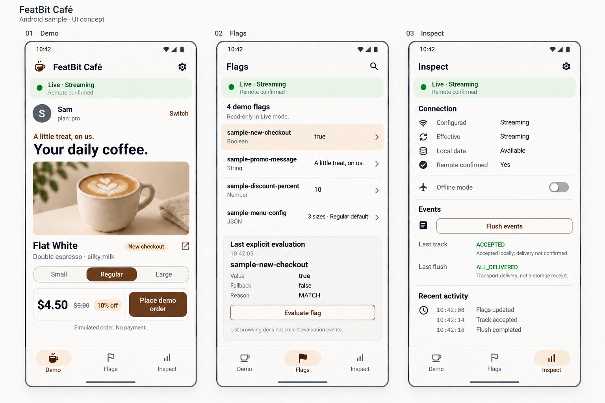

# FeatBit Café — Shared Sample App Design

Status: design only; neither sample app has been implemented.

Design revision: 2026-10-03. The expanded interactions, state rules, business contract,
and behavioral acceptance below are accepted design scope. Engineering decisions are documented separately.

This document is the shared design for the future **Kotlin and Java Android samples**.
Both apps demonstrate the same business scenario, screens, flag contract, SDK behavior,
and acceptance criteria. Language-specific integration code differs; product behavior does not.

## 1. Purpose and scope

Help developers experience feature flags in a small coffee-ordering app, then understand
and reuse the SDK integration. The sample combines a business demonstration with SDK
inspection. Orders are simulated: there is no payment, shopping cart, account backend,
or actual fulfillment.

The primary journey is:

1. Launch a working local demo without credentials or a running service.
2. Change local flags and observe the business UI update.
3. Configure a FeatBit environment and connect to it.
4. Change flags and targeting rules in FeatBit and observe remote updates.
5. Switch users, go offline, and inspect event-operation results.

A successful sample demonstration does not replace the SDK's release or physical-device
acceptance. The implementation guide explains the separate engineering verification responsibilities.

## 2. Design boundary and document map

This is one Android product design, independent of implementation language. Kotlin and Java
are planned implementations of this contract; neither gets a separate UI or business specification.
Android navigation, accessibility, lifecycle-visible behavior, and SDK outcome semantics are
product/platform requirements. Async APIs, widgets, file structure, and build tools are engineering choices.

- This document: audience, screens, visuals, data, business rules, scope, and success criteria.
- [Interaction design](./interaction-design.md): state transitions, controls, errors, and continuity.
- [Environment and acceptance](./setup-and-acceptance.md): demonstration data and observable scenarios.
- [Implementation guide](./implementation-guide.md): Kotlin/Java APIs, native Views, shared resources,
  module organization, build/run instructions, and engineering verification.

## 3. Visual reference



- [Classic and compact checkout comparison](./ui-checkout.png)
- [Connection and user-switching flows](./ui-connection-users.png)
- [Local flag editing and evaluation details](./ui-flag-editing.png)
- [Detailed interaction and state specification](./interaction-design.md)
- [Environment setup and behavioral acceptance](./setup-and-acceptance.md)
- [Image generation briefs and review notes](./image-prompts.md)

This generated image is a visual concept, not a screenshot of an implemented app.
It illustrates the Live state of the three main screens. The written behavior below
governs states not shown in the image, including first launch, local editing, connection
setup, errors, and user switching.

Use native Android/Material navigation and controls, warm neutral surfaces, espresso-brown
primary actions, restrained amber accents, and explicit status text. Keep the business
preview prominent and the inspection screens compact and readable. UI copy is English
in both apps. Support light/dark themes, system font scaling, accessible touch targets,
system Back, and window/keyboard insets. Adapt navigation and content for wider windows.

The revised overview shows Sam/pro. Canonical presets remain Alex/free and Sam/pro.
The original `ui-design.png` is retained as a superseded concept, not implementation authority.
The coffee photo is conceptual imagery and is not yet a separate implementation asset.
Images illustrate composition; exact strings, data, and interaction rules are governed by
these documents. All implementations present the same product imagery and visual system.

## 4. Navigation and screens

Use three primary destinations: **Demo**, **Flags**, and **Inspect**. Open **Connection**
from a settings action. Keep the selected destination and current business state through
Activity recreation. A compact shared status strip identifies Local or Live mode and
summarizes the current SDK state without implying a remote connection in Local mode.

### Demo

- Show the current sample user and a **Switch** action opening the user panel.
- Display one coffee product, promo text, cup-size choices, price, and discount.
- A Boolean flag switches between classic and compact checkout layouts.
- Classic uses a vertical size radio list, separate price breakdown, and full-width order
  button. Compact uses segmented sizes and a unified amount/order action surface. Preserve
  the selection when switching layouts; neither layout changes pricing or event behavior.
- Provide unobtrusive links from affected UI regions to their flag details.
- **Place demo order** records a simulated action and calls Track in Live mode.
- Always state **Simulated order. No payment.**

### Flags

- List the four demo flags, their expected types, current values, and detail actions.
- Keep a row visible for a missing demo flag so its fallback remains discoverable.
- Passive list inspection must not collect evaluation events.
- A detail view shows the expected type and fallback. **Evaluate flag** performs an explicit
  evaluation and displays the returned value and reason.
- Separate **Current snapshot** from timestamped **Last explicit evaluation**. Relevant flag,
  identity, or client changes mark the previous evaluation **Out of date** without silently
  evaluating again. Before the first evaluation, display **Not evaluated yet**.
- Distinguish `MATCH`, `CLIENT_NOT_READY`, `FLAG_NOT_FOUND`, `WRONG_TYPE`, and `ERROR`.
- Local mode supports editing values, removing a flag, and restoring defaults through TestData.
- Live mode is read-only and directs the developer to FeatBit to change flag configuration.
- JSON summaries come from the sample's validated menu schema, not inferred SDK metadata.

### Inspect

- Show configured/effective sync mode, sync status, all pause reasons, local-data availability,
  remote confirmation, nullable success/failure times, and safe diagnostics when available.
- Provide an **Offline mode** switch for the existing client and **Flush events** action.
- Show actual Track and Flush outcomes, separately from synchronization status.
- Show a bounded in-memory recent-activity list of application actions and SDK notifications.
- Record timestamps as observations; the list is not a complete network or SDK audit log.
- Never invent per-flag cache provenance, queue lengths, transport traces, or delivery receipts.

### Connection

- Choose **Local Demo** or **Live Connection**.
- Live configuration contains Client SDK Key, Streaming/Polling selection, applicable sync
  endpoint, and an explicit events-enabled choice with Events URL when enabled.
- Start Live configuration with Streaming and events enabled, matching the SDK defaults.
  Missing Events URL requires a correction or explicit opt-out, not silent disabling.
- Validate configuration before applying it and show useful errors next to the fields.
- **Apply and reconnect** closes the previous client and creates a new one when creation-time
  settings change. Conflicting actions wait for this transition; old results cannot overwrite the new state.
- Do not treat client creation, online transition, or connection handshake as remote readiness.
- Use fictional placeholders, mask the Key field, and exclude credentials from activity logs.
  Entered connection settings and drafts last only for the current process, survive rotation,
  and are never restored after process death. Process restart starts Local Demo with Alex
  and the default test flags.

## 5. Flag and business contract

| Flag key | Type | Business effect | Fallback / local initial value |
| --- | --- | --- | --- |
| `sample-new-checkout` | Boolean | Classic versus compact checkout | `false` / `true` |
| `sample-promo-message` | String | Promo copy | `Fresh coffee, made for you.` / `A little treat, on us.` |
| `sample-discount-percent` | Number | Displayed discount and order amount | `0` / `10` |
| `sample-menu-config` | JSON | Available cup sizes and default selection | Basic menu / basic menu |

The basic menu contains `sizes` (Small, Regular, Large) and `defaultSize` (the ID `regular`).
Each size has an `id` and `label`; stable IDs are `small`, `regular`, and `large`.
The default selection refers to an existing size ID. Validate nonempty sizes, unique IDs,
nonblank labels, and a valid default selection in sample business code.

Use a base price of USD 5.00 for this demonstration; cup sizes do not change the base price.
Accept a finite discount between 0 and 100 inclusive, otherwise use the business fallback
of zero. Calculate using decimal arithmetic and round the final total to two decimal places
with half-up rounding (a halfway amount rounds upward for these nonnegative prices).
Display discount amount as base price minus rounded total. A 10% discount
therefore displays USD 4.50. Preserve a selected size if a menu update still contains it;
otherwise use the new valid default. Capture displayed size, discount, and total at the order
tap; subsequent flag changes must not alter that simulated order or its Track numeric value.

Canonical copyable menu value (data, not application implementation):

```json
{
  "sizes": [
    { "id": "small", "label": "Small" },
    { "id": "regular", "label": "Regular" },
    { "id": "large", "label": "Large" }
  ],
  "defaultSize": "regular"
}
```

Require a JSON object with the documented field types; ignore additional fields. JSON null,
missing fields, an empty size list, duplicate IDs, blank IDs/labels, or an unknown default ID
produce the business fallback. IDs are matched exactly and case-sensitively. Do not infer size
prices: all sizes cost USD 5.00 before discount. Zero discount hides the promo price decoration;
100% displays USD 0.00 and still permits a simulated order.

A JSON value can be valid to the SDK but invalid as a menu. Display **Invalid menu configuration**
and use the basic menu in that case. Do not mislabel this as SDK `WRONG_TYPE`. These menu
and discount checks are sample business rules, not new SDK validation requirements.

## 6. Local and Live behavior

| Capability | Local Demo | Live Connection |
| --- | --- | --- |
| Default launch | Available immediately | Explicit configuration required |
| Source | TestData | Built-in Streaming or Polling |
| Flag edits | In-app TestData operations | FeatBit control plane |
| User targeting | Not simulated; all users share the test snapshot | Evaluated by the service |
| Events | Disabled; explain this in the UI | Actual SDK outcomes |
| Production cache | Disabled by TestData | SDK cache behavior |
| Readiness | Local readiness | Separate local availability and remote confirmation |

Local Demo is not the same as setting a Live client offline. TestData has its own lifecycle:
updates while paused can return `SAVED_FOR_NEXT_START`, which must not be presented as
already applied. Show `COMMITTED` only when the returned result says so.

Offline Live operation retains available local values. New Track calls are suppressed;
already accepted events remain subject to SDK retention limits. Returning online does
not itself guarantee remote readiness. A terminal subsystem requires a new client to retry.

Retain Local edits, including removed flags, when leaving Local mode. Returning to Local in
the same process restores those edits. Restore actions affect only Local test data; they never
modify Live configuration, server flags, SDK cache, or user identity.

Without remote data or matching cached data, Live uses the documented fallbacks; it must not
present the Local demo snapshot as if it came from the service.

## 7. Users and targeting

| Display name | Key | Attribute |
| --- | --- | --- |
| Alex | `sample-alex` | `plan=free` |
| Sam | `sample-sam` | `plan=pro` |

Start with Alex. The Live setup guide should explain how to create a targeting rule enabling
`sample-new-checkout` for `plan=pro`, with a false default. Do not implement this targeting
rule inside the app. Local mode explicitly explains that switching users does not simulate targeting.

Use Identify for user changes, with visible pending and outcome states. Separate the requested
user and synchronization outcome. A synchronization timeout does not imply that the identity
change was rolled back; do not restore the old user label solely because a wait timed out.
Allow only one user change at a time; an older change must not overwrite a newer selection.

## 8. Events and result semantics

Use `sample-order-completed` for the simulated order event, with the displayed order amount
as the numeric value. Repeated identical calls may deduplicate; explain the actual result.
The Live setup guide must identify the corresponding event configuration needed in FeatBit.

- Track: distinguish `ACCEPTED`, `DEDUPLICATED`, and `SUPPRESSED`; also handle outer failures.
- Flush: inspect the outer Outcome first, then `EMPTY`, `ALL_DELIVERED`, or
  `PROCESSED_WITH_LOSS` on success. Display `DISABLED`, `DEFERRED`, timeout, and errors accurately.
- **Accepted** means accepted locally, not delivered. Successful transport delivery is not
  proof of database persistence or experiment-report processing.
- Do not infer delivery from absent diagnostic logs. Events are memory-only.
- Normal UI redraws must not trigger repeated evaluations or Track calls. Evaluate for
  initial business display and relevant data changes; Track only explicit simulated orders.

## 9. Continuity and responsiveness

Navigation and rotation preserve the active connection, selected user, current business state,
and pending-operation feedback. Leaving a screen must not disconnect the app. Interface actions
remain responsive while SDK work proceeds; dismissing a screen does not imply cancellation.
Initial values and subsequent updates must appear coherently, without missing a change during
screen entry or showing another user's data as current.

Applying a new connection retires the old one. Late results cannot replace the new screen state;
incomplete cleanup or undelivered events remain visible when reported. Each installed variant
has independent connection settings, stored data, selections, and history. They share the same
in-app branding and business experience; an implementation identifier and SDK version in Inspect
help distinguish evidence from different builds. Engineering mechanisms live in the implementation guide.

## 10. First version and deferred work

First version: the three main screens, Connection, two fixed users, four demo flags,
TestData editing, Live synchronization, offline control, Track, Flush, and readable diagnostics.

Deferred: anonymous identity/reset UI, arbitrary user attributes, Custom sources, arbitrary
headers, full SDK settings editor, advanced background-policy controls, persistent activity logs,
and experiment analytics dashboards. Engineering compatibility checks are defined separately.

## 11. Shared acceptance checklist

Run the same behavioral scenarios for every implementation, using identical environment configuration.
The numbered operation/visible-result/SDK-result matrix in
[setup and acceptance](./setup-and-acceptance.md) is the shared parity checklist.

- Local mode launches without credentials or network dependencies.
- All four local flag types update the business UI; removal exposes the documented fallback.
- Invalid menu/discount business data falls back without misreporting SDK errors.
- Live control-plane updates change the visible business UI through subscriptions.
- Alex/Sam targeting reflects service rules; Local mode does not fabricate targeting.
- Offline, resume, missing flags, wrong types, configuration errors, and readiness timeout
  have accurate and usable feedback.
- Track and Flush show real outcomes, including deduplication and suppression.
- Connection/user changes do not display stale results from previous work.
- Navigation and rotation retain one coherent session without duplicated actions or stale UI updates.
- Build, artifact, and resource-lifecycle checks are defined in the implementation guide.
- Inspect visible results on an emulator/device, including dark theme, larger fonts, and
  narrow/wide layout. Build success alone is not UI verification.
- Report the actual validation scope; sample checks do not establish physical-device sleep,
  database/MQ persistence, hosted CI, or formal release acceptance.

## 12. Related contracts

- [SDK handoff](../docs/handoff.md)
- [Integration guide](../docs/integration.md)
- [Implementation plan](../plan.md)
- [SDK architecture](../architecture.md)
- [Release conformance](../docs/conformance.md)

Follow these SDK contracts if behavior evolves. Update this single shared design when the
sample experience changes; implementation language must not change its product requirements.
