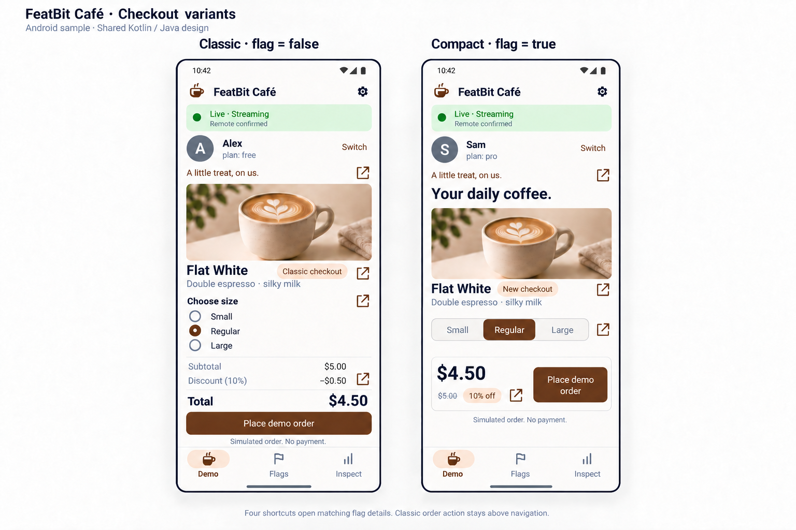
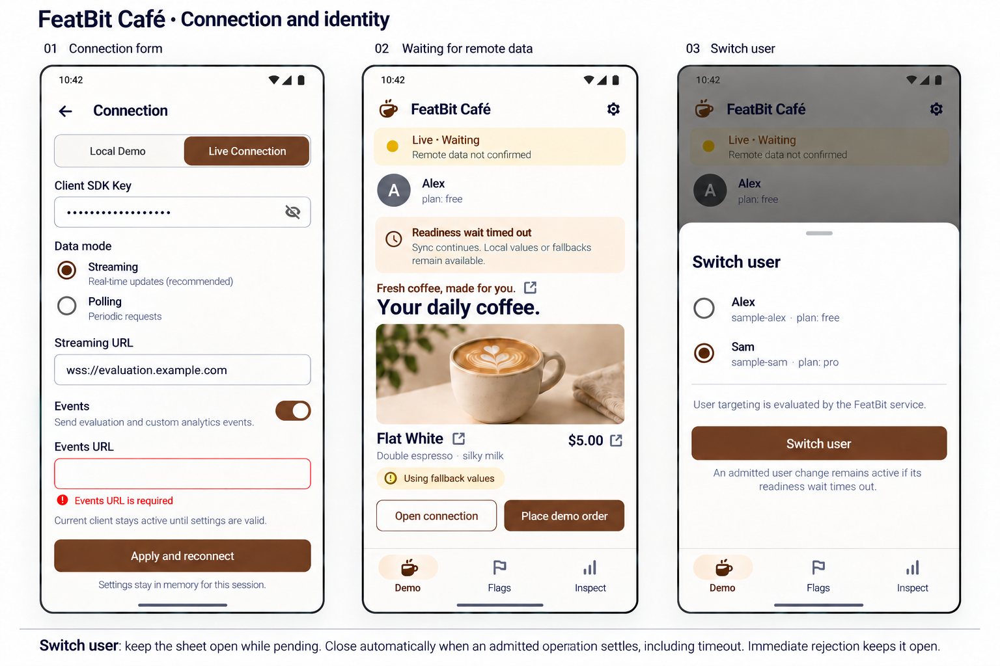
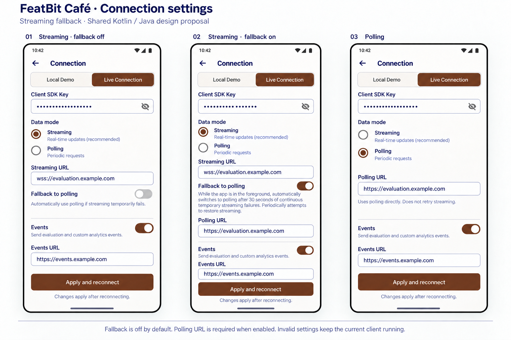
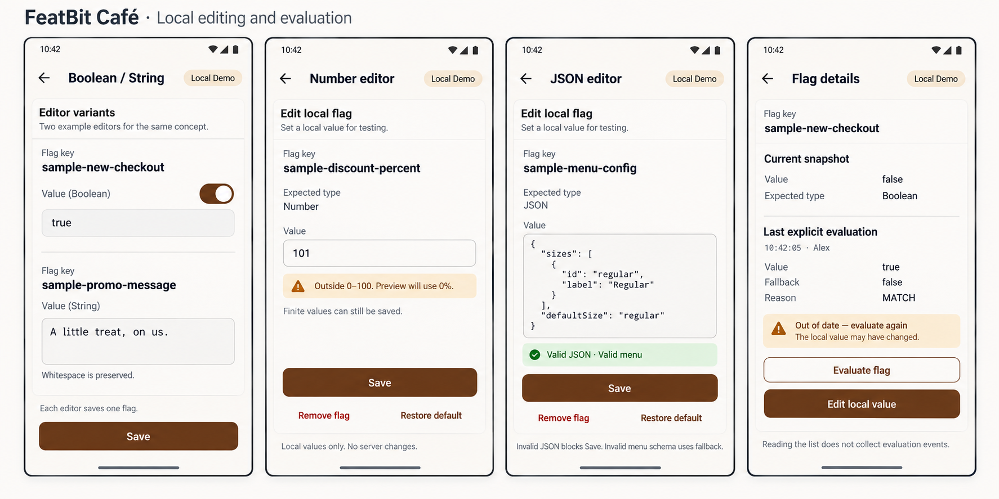

# Shared interaction and state specification

Applies to every implementation, independently of language. This supplements [the shared design](./README.md).
This is the acceptance contract; actual verification scope is recorded separately for each app.

## Checkout

The Boolean flag controls layout only. Classic presents sizes as a vertical radio list,
then subtotal, discount amount, total, and a full-width **Place demo order** button.
Compact presents segmented sizes and an amount/button action area. For many or long size
labels, wrap the choices; at large font scales stack amount and button rather than clipping.
All sizes have the same base price. Keep promo copy, product information, and navigation
in both variants. The image may abbreviate supporting copy to explain the layout difference.

Preserve the selected size across layout changes. Menu changes preserve it only when the
ID still exists. One tap creates one application-side simulated-order record using the
currently displayed values; it does not re-evaluate flags while handling the tap. Subsequent
taps are distinct UI actions, but the SDK may deduplicate identical event data. Do not promise
one metric event per tap. Local orders show **Demo order created · Events disabled in Local**.

## Connection and identity

Connection is a full screen with Back, a Local/Live selector, applicable fields, and a bottom
primary action. Editing a draft does not change the running client. Back dismisses the form
without applying and preserves its draft for the current process. Dismissing during a submitted
operation does not cancel SDK work; progress remains visible in the shared status area.

- Local selection explains **No service, targeting, analytics, or production cache**.
- Live selection shows masked Client SDK Key, Streaming/Polling selector, applicable sync URLs,
  Events enabled switch, and Events URL. Streaming can additionally enable the fallback path
  specified below. Hide inactive fields and exclude them from validation/submission, retaining
  their drafts. Disable Events URL submission when events are disabled.
- Empty required fields receive inline errors. Schemes and enabled-path validation follow the
  SDK configuration contract. Use secure fictional placeholders; do not rewrite the user's deployment path.
- **Apply and reconnect** validates a complete proposed configuration before touching the current
  client. Invalid input keeps the existing client and rendered state intact.
- Once valid, retire the current connection before activating its replacement. Show one
  reconnection in progress; late results from the old connection cannot update the current UI.
- Use configured SDK Close timeout. If Close reports undelivered events or incomplete cleanup,
  show the actual warning. The old client is retired; do not silently reinstate it or claim all
  work was delivered. Do not repeatedly create clients on an unresolved/stuck transition.
- Create failure leaves no active replacement client. Preserve the submitted draft, display
  fallback business content, disable SDK actions, and offer **Retry** / **Return to Local Demo**.
- Successful Create starts readiness observation. A readiness timeout leaves the new client
  alive: show **Waiting for remote data · Wait timed out**, allow available local/fallback use,
  and let subsequent SDK status updates indicate recovery. No automatic client-recreation loop.
- Selecting Local from a terminal/failed connection uses the same serialized replacement path.

### Streaming fallback settings

Both Connection forms implement this design, including the SDK polling fallback
option. Both languages follow the same contract.
The new board governs transport settings; the connection/identity board still documents
validation and user switching.

| Selected mode | Visible transport fields | Required for submission |
| --- | --- | --- |
| Streaming, fallback off (default) | Streaming URL; Fallback to polling switch off | Streaming URL |
| Streaming, fallback on | Streaming URL; switch on; Polling URL below it | Both URLs |
| Polling | Polling URL only; no fallback switch | Polling URL |

Use the label **Fallback to polling**. With the switch off, show:

> Automatically use polling if streaming temporarily fails.

With the switch on, show this exact helper text, wrapping without truncation:

> While the app is in the foreground, automatically switches to polling after 30 seconds of continuous temporary streaming failures. Periodically attempts to restore streaming.

Direct Polling shows **Uses polling directly. Does not retry streaming.**
Switching modes or toggling fallback preserves URL and fallback drafts in this process.
Returning from Polling to Streaming restores the previous fallback choice. Hidden settings
are not applied. Do not derive a Polling URL from the Streaming URL: deployments may differ.
Edits take effect only after **Apply and reconnect**. Missing or invalid required URLs show
inline errors and leave the running client unchanged. Preserve the Events controls below
transport settings. Keep the form scrollable at large font scales and with the keyboard open.

In Inspect, preserve separate Configured and Effective modes. Show **Polling fallback active**
only when the running SDK reports actual fallback, not merely when the option is enabled or
when an unapplied draft changes. Initial readiness timeout and fallback are separate states.
Transient failures may cause automatic fallback; authentication/terminal errors do not.

### Readiness and user switching

Show a readiness timeout after the sample's 5-second initial-readiness or user-switch wait.
This ends that wait, not ongoing synchronization. Conflicting actions remain serialized;
there is no timeout editor. Adapter scheduling and operation timeout configuration are specified
in the [implementation guide](./implementation-guide.md#sdk-integration-details).

The user bottom sheet lists Alex/free and Sam/pro, marks the selected sample user, and has
**Switch user**. Selecting the already selected preset is a no-op. While Identify is pending,
show **Switching to Sam…**, disable repeated switching, mode/client changes, and ordering;
allow navigation and passive inspection. Stop showing the old user's business values as current.
Keep the currently adopted user selected while identifyContext is pending; the busy message names
the requested user. Pause business/snapshot refresh until the receipt confirms adoption. On adoption
failure or timeout, retain the old user and keep the sheet open with a failure message.
After successful adoption, select the new user, refresh and awaitReady using the remaining shared
5-second budget. Close the sheet when readiness finishes, including timeout. A readiness timeout
retains the new user with an unconfirmed status; it never rolls the selection back.
The latest accepted user action owns the UI. Do not infer the selected user from flag values.
The implementation guide maps these outcomes to the public SDK contract.

## State and action matrix

States are orthogonal: use both app operation state and actual SDK status. Do not collapse
local availability, remote confirmation, explicit offline intent, and events into one boolean.

| Condition | Visible feedback | Permitted actions / behavior |
| --- | --- | --- |
| No client, first launch | Preparing local demo | Navigation available; client actions disabled until Create completes |
| Draft invalid | Field error; current connection remains visible | Correct/cancel draft; current client continues |
| Closing/creating replacement | Reconnecting; previous content marked inactive | Disable order, Identify, offline, Flush, edits, and duplicate Apply; navigation remains available |
| Create failed | Connection failed + diagnostic | Retry or Local; render fallbacks, no SDK actions |
| Local ready | Local Demo · Ready; no remote claim | Local editing, simulated orders, user switching, offline control; Flush disabled with explanation |
| Live waiting, including wait timeout | Waiting for remote data; local availability shown separately | Use current-context values/fallbacks, order/Track, switch user, offline, or reconnect |
| Live confirmed | Live + effective mode + remote confirmation | Normal actions |
| Identify pending | Adopted user retained until receipt; requested user named in Switching | Disable conflicting operations and ordering; passive navigation remains available |
| Mode operation pending | Going offline / Going online | Disable conflicting operations until settled; no speculative switch position |
| Explicit offline | Offline · Local values; confirmation shown separately in Inspect | Simulated orders call Track and show suppression; user switch allowed; Flush may report DEFERRED |
| Network/background pause | Paused + actual reasons | Never display this as explicit Offline; use available data; resume through SDK behavior |
| Sync terminal | Sync stopped + safe code + Reconnect | Local/fallback rendering remains; event behavior follows its own actual results |
| Events disabled | Events disabled | Simulated order still works; Track can show suppression; Flush disabled with explanation |
| Event failure | Last event operation failed | Keep sync status independent; show actual outcome; no fabricated queue health |
| Flush pending | Flushing… | Disable duplicate Flush only; later orders are not promised to be covered by that Flush |

Offline and remote-confirmed can coexist; a past confirmation does not mean the current
connection is live. No diagnostic history timestamp overrides current status. Use text/icons
in addition to colors. After Close, old readable values are inspection history, not active state.

## Flag details and local editor

Flag details are a full screen with Back, key, expected sample type, and **Current snapshot**.
Label the sample contract as **Expected type**; do not claim unsupported remote type metadata. **Last explicit evaluation** has time,
value, fallback, reason, and **Evaluate flag**. Before first use show **Not evaluated yet**.
Update passive snapshot state without an implicit evaluation. Mark the previous explicit
result **Out of date — evaluate again** after a relevant change, identity change, client change,
or observation gap where freshness cannot be established. Keep the historical result visibly
separate; never attribute it to the new user. Conservative invalidation is acceptable for both apps.

Local editing opens a sheet (full-height when JSON or the keyboard needs room):

| Expected type | Editor | Validation |
| --- | --- | --- |
| Boolean | True/false switch and text value | Fixed Boolean type |
| String | Multiline plain text | Empty string allowed; preserve entered whitespace |
| Number | Signed decimal text input | Finite number; parse consistently independent of device locale |
| JSON | Multiline monospaced text | Valid JSON under the SDK contract; menu-schema warnings separate |

Keep the flag's expected type fixed in the editor. Live wrong-type demonstration uses control-plane
configuration rather than introducing an arbitrary type-switching UI. Allow valid JSON with an
invalid menu schema and finite numbers outside the business discount range to be saved, with a
warning that the business preview will use its fallback. Invalid JSON or nonfinite numeric input
blocks Save. A JSON field retains a raw view even if a menu summary is unavailable.

- **Save** updates one local flag; disable duplicate submissions while pending.
- `COMMITTED`: close editor and show **Applied locally**. `SAVED_FOR_NEXT_START`: show **Saved;
  applies when resumed**, retain the edited test snapshot, and do not fake a current-view update.
- Failure keeps the editor and draft; show actual diagnostic information. Cancel/Back before Save
  discards the unsubmitted editor draft; after Save, dismissal does not cancel the operation.
- **Remove flag** removes only this local key after a small confirmation naming it. Keep its
  catalog row, show missing/fallback on the next committed snapshot, and allow re-creation.
- **Restore default** restores only this key's initial value/type, including a previously removed key.
- **Restore all demo flags** confirms that all four local edits/removals will be replaced, then
  restores the canonical initial snapshot as one atomic change. It does not reset
  user, offline intent, selected tab, connection draft, or production cache. Normal menu selection
  reconciliation still applies if restoring the menu removes a selected ID.

## Persistence, observation, and layout

| State | Activity recreation | Process restart |
| --- | --- | --- |
| Connection, Local edits, selected user, connection drafts | Preserve | Start Local, Alex, default test snapshot |
| Destination, selected size, open form/editor | Restore within current process | Demo, Regular, no open form |
| Credentials | Preserve for this process only | Cleared; require re-entry for Live |
| Activity history, last evaluations/orders | Keep, bounded | Cleared |
| SDK Live cache | SDK-owned | Remains eligible when the same Live environment/context is configured again |

Bound recent activity to 100 entries, oldest removed first. Bound visible last-order and last-read
state rather than accumulating unbounded histories. Separate current submitted configuration from
the editable draft. Each app's sandbox is independent even when both connect with identical presets.

At compact widths use bottom navigation and scrolling content; at widths of 600dp and above use
a navigation rail and bounded content width. Detail/forms retain a clear Back path. With large
fonts, allow buttons/rows to grow and checkout segments to wrap. Keep touch targets at least 48dp,
respect system insets, and announce validation/status text accessibly. Dark mode uses themed roles,
not inverted bitmap colors. Actual device evidence and limitations are recorded in [Kotlin verification](./kotlin/VERIFICATION.md)
and [Java verification](./java/VERIFICATION.md).
